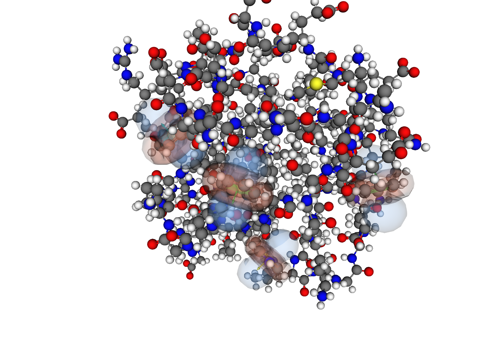

# Geometric Kernel as Feature Extraction

Computes geometric kernel tensors from protein structures — ring
currents, electric field gradients, peptide bond anisotropy, and
other classical contributions to NMR shielding.  These are geometric
features, not shielding tensors themselves (unless DFT reference
data from ORCA is supplied alongside the structure).



10 calculators (8 classical + 2 MOPAC-derived) produce full rank-2
tensor output per atom.  An equivariant calibration pipeline tunes
~80 kernel parameters against DFT WT-ALA deltas across 723 proteins.

See [spec/INDEX.md](spec/INDEX.md) for documentation reading order.

## Dependencies

Full inventory: [spec/DEPENDENCIES.md](spec/DEPENDENCIES.md)

**System packages:**
```
apt install libeigen3-dev libdssp-dev libcifpp-dev libapbs-dev libfetk-dev
```

**Conda:**
```
conda install -c conda-forge openbabel
pip install propka
conda create -n xtb-env && conda install -n xtb-env -c conda-forge xtb
```

**Build from source:** GROMACS 2026.0, reduce 4.10

**Test framework:** GTest 1.14.0 (fetched by CMake)

**Python (calibration):** e3nn, numpy, torch
