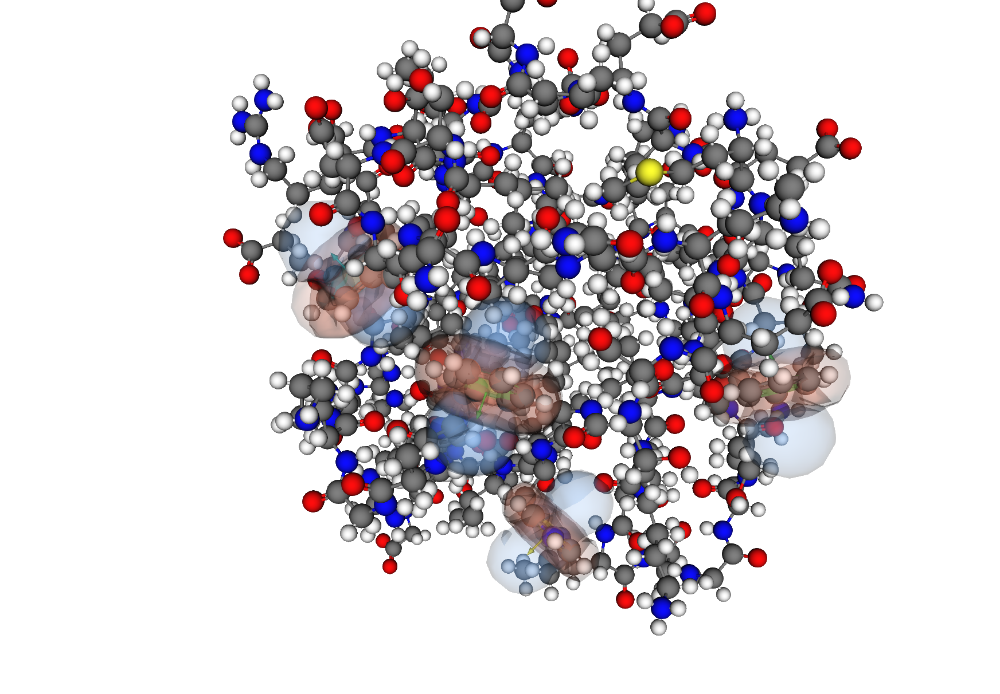

# Geometric Kernel as Feature Extraction

Computes geometric kernel tensors from protein structures — ring
currents, electric field gradients, peptide bond anisotropy, and
other classical contributions to NMR shielding.  These are geometric
features, not shielding tensors themselves (unless DFT reference
data from ORCA is supplied alongside the structure).



The classical electromagnetic kernels (8 + 2 MOPAC-derived) produce
full rank-2 tensor output per atom.  Alongside them the production stack
runs field/charge calculators (APBS, AIMNet2), scalar/vector feature
calculators (EEQ charges, SASA, water + hydration geometry), and the
literature-comparison families (tripeptide, Larsen).  An equivariant
calibration pipeline tunes the calculator parameters against DFT WT-ALA
deltas across 720 proteins.

See [spec/INDEX.md](spec/INDEX.md) for documentation reading order.

## Dependencies

Full inventory: [spec/plan/bones/DEPENDENCIES.md](spec/plan/bones/DEPENDENCIES.md)

**System packages:**
```
apt install libeigen3-dev libdssp-dev libcifpp-dev libapbs-dev libfetk-dev
```

**Conda:**
```
conda install -c conda-forge openbabel
```
(Protonation is an upstream preconditioning step done before
`nmr_extract` — `reduce` for bare PDBs, or already-protonated input —
so no pKa-prediction tool is a build dependency here.)

**Build from source:** GROMACS 2026.0, reduce 4.10

**Test framework:** GTest 1.14.0 (fetched by CMake)

**Python (calibration):** e3nn, numpy, torch
