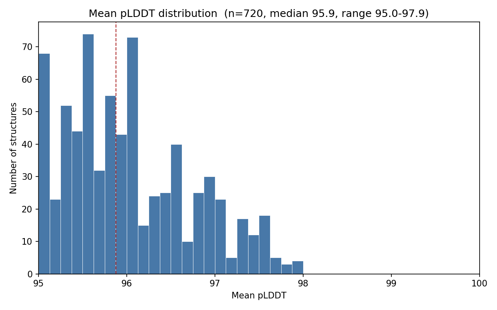
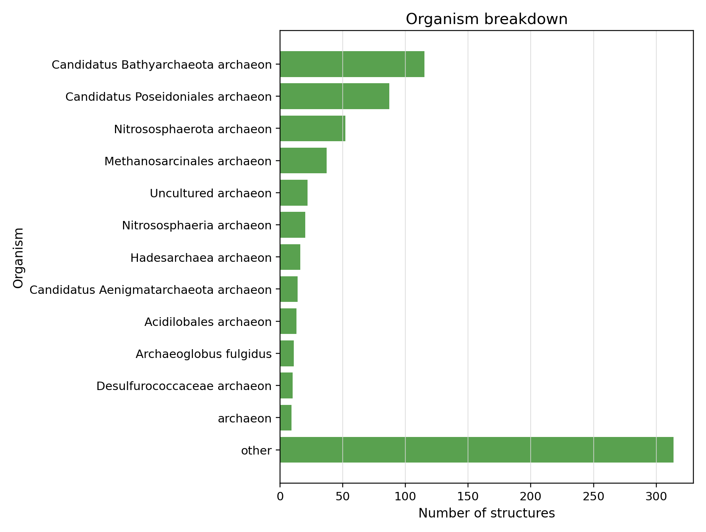
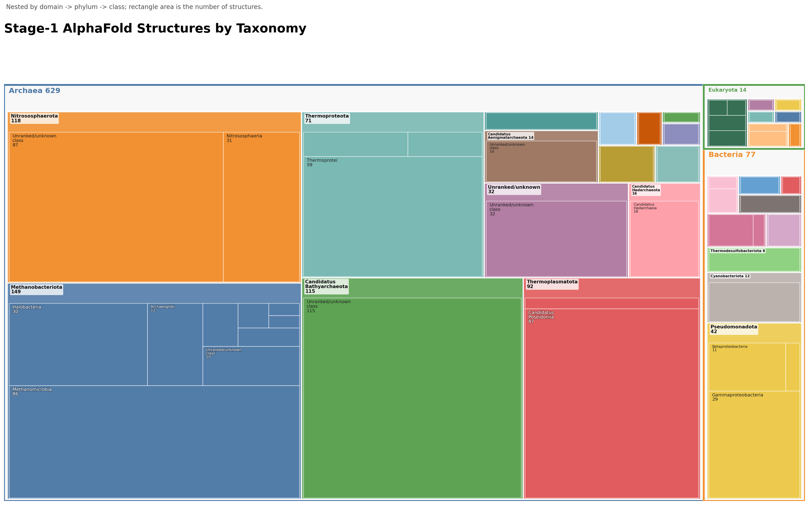
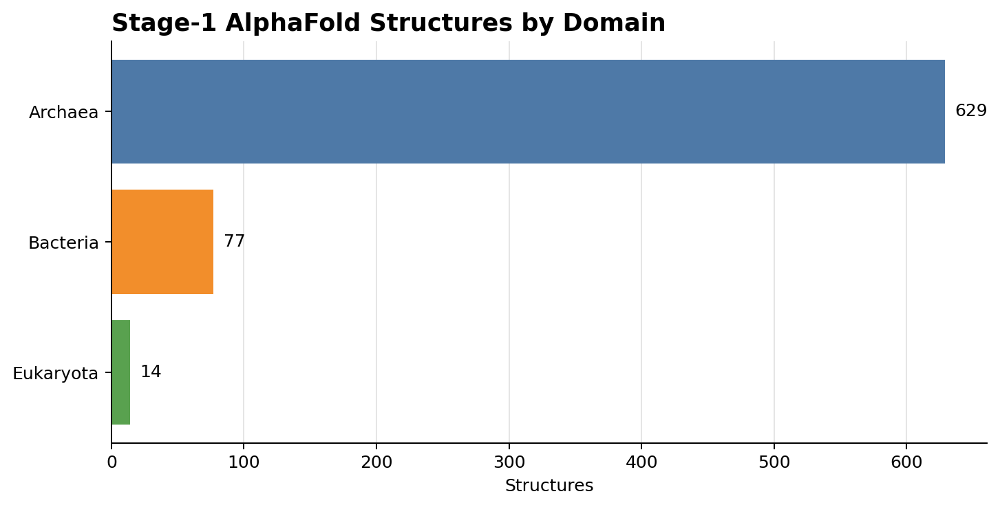
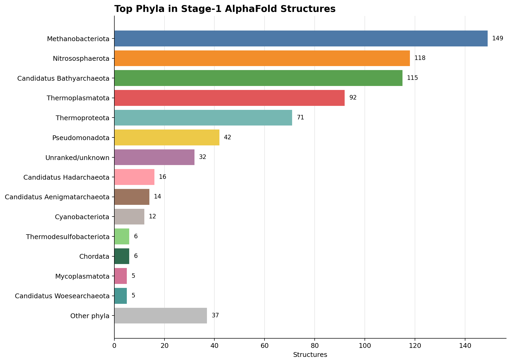

# AlphaFold DB accession provenance

- Headline: 720 accessions, 720 resolved on AFDB, mean pLDDT 96.02, median pLDDT 95.88, 226 distinct organisms, AFDB model version(s) present: 6.
- Confirmation: protein_id = UniProt/AFDB accession; AFDB entry = AF-{accession}-F1; entry URL = https://alphafold.ebi.ac.uk/entry/{accession}.
- Non-resolving accessions: 0.

## Charts

- 
- 

## Example rows

| accession | model_entity_id | latest_version | mean_plddt | organism | gene | seq_length |
|---|---:|---:|---:|---|---|---:|
| A0A062V9G2 | AF-A0A062V9G2-F1 | 6 | 96.62 | Candidatus Methanoperedens nitroreducens | ANME2D_01814 | 48 |
| A0A075FL01 | AF-A0A075FL01-F1 | 6 | 96.12 | uncultured marine thaumarchaeote AD1000_01_A07 | msrAB | 43 |
| A0A075FR84 | AF-A0A075FR84-F1 | 6 | 95.06 | uncultured marine thaumarchaeote AD1000_40_H03 |  | 43 |
| A0A075FUC0 | AF-A0A075FUC0-F1 | 6 | 95.25 | uncultured marine thaumarchaeote AD1000_54_F06 |  | 43 |
| A0A075FUI5 | AF-A0A075FUI5-F1 | 6 | 95.69 | uncultured marine thaumarchaeote AD1000_54_F06 |  | 48 |

## Aggregate stats

| metric | value |
|---|---:|
| Accessions | 720 |
| Resolved on AFDB | 720 |
| Non-resolving accessions | 0 |
| Mean pLDDT | 96.02 |
| Median pLDDT | 95.88 |
| Distinct organisms | 226 |
| AFDB model version(s) | 6 |

## Taxonomy

UniProt taxonomy lineages place the 720 Stage-1 structures across three domains, with an archaeal-rich spread: Archaea 629, Bacteria 77, and Eukaryota 14.

Top phyla by structure count: Methanobacteriota 149; Nitrososphaerota 118; Candidatus Bathyarchaeota 115; Thermoplasmatota 92; Thermoproteota 71; Pseudomonadota 42; unranked/unknown phylum 32; Candidatus Hadarchaeota 16; Candidatus Aenigmatarchaeota 14; Cyanobacteriota 12.

- 
- 
- 
