# IN-PROTEIN STATISTICS

## Outline

1. Scope and variables: this is a within-protein account of geometric kernels, not calibrated shielding. Stage 1 supplies the 720-protein within-protein corpus; Stage 2/1P9J supplies a single-protein within-axis law-recovery instrument.
2. Major backbone results: full source-block kernel correlations, local dihedral geometry, contributor overlap, and the bb_N torsion-axis view.
3. All-atom results: 242 within-supported named atom strata, all six tensor targets, element/surface stratification, and explicit separation of backbone N from sidechain/terminal N.
4. Contributors: every exact contributor block present in the within top-20 all-atom tables, including charge, q-over-r^3/electrostatic EFG, ring current, ring EFG, ring dispersion, McConnell/bond anisotropy, MOPAC-field, APBS field, H-bond, solvation, secondary structure, and planar geometry.
5. Stage 2/1P9J within-axis recovery: charge q/r^3, ring current, and the unified `D_ab`-sum are within-axis recoveries. The unified combine is a real combine carried by MOPAC-field plus McConnell with charge near zero; it does not make a between-protein or between-atom transfer claim.

## Scope

The reported quantities are fitted correlations between geometric kernels and tensor targets. Calibration is the later step that turns kernels into shielding. Here, source-block coefficients are model diagnostics, not physical constants.

`within_protein_z` is the central normalization: each protein is centered and scaled internally before fitting. This means the reported values describe within-protein modulation, not between-protein offsets. The Stage 1 backbone/all-atom tables carry the 720-protein corpus axis; 1P9J carries the single-protein within axis only. Source: `S1/R/matrix_common.R:64-73`, `S1/R/36_backbone_atom_multisource_blocks.R:413-434`, `h5-reader/src/rediscover/NOW.md:57-79`.

Path aliases used below:

- `S1 = /mnt/expansion/nmr-shielding-release-cleanup-20260528/learn/stage1-topology-workup-20260514`
- `REDIS = /shared/2026Thesis/nmr-shielding/h5-reader/src/rediscover`
- `OUT = /shared/2026Thesis/nmr-shielding/doc/thesis-overview/in-protein-stats`

## Equations

Within-protein normalization, applied separately inside each protein `p`:

```math
z_{ij}^{(p)} = {x_{ij}^{(p)} - \mu_j^{(p)} \over s_j^{(p)}}
```

with insufficient or zero-variance groups written as zero after the safe-scale step. Source: `S1/R/matrix_common.R:55-73`.

Ridge fit used for source-block signal capture:

```math
\hat{\beta}_\lambda = (X^T X + \lambda I)^{-1} X^T Y,
\qquad
\hat{Y} = X \hat{\beta}_\lambda
```

```math
R^2 = 1 - {\sum_i (Y_i - \hat{Y}_i)^2 \over \sum_i (Y_i - \bar{Y})^2}
```

Source: `S1/R/matrix_common.R:75-115`.

Rank-2 tensor handling remains a five-component `T2` object in the Stage 2 code. Scalar summaries such as `total_t2_norm` are explicitly norm comparisons, not replacements for the tensor:

```math
T = T0 \, B_0 + \sum_{m=1}^{5} t_{2m} B_{2m}
```

The shared through-space symmetric tensor shadow is:

```math
D_{ab}(r) = {3 r_a r_b \over r^5} - {\delta_{ab} \over r^3}
```

and the unified Stage 2 combine is a linear sum over flattened five-component `T2` features:

```math
\hat{y}_{T2} =
\sum_s \beta_s \, \mathrm{vec}\!\left(T2_s\right)
```

where the included unified terms are charge, McConnell categories, MOPAC/water field EFG, geometric H-bond, pi-quadrupole, and dispersion terms. Ring current is not included in this symmetric `D_ab` sum; it is carried as a separate current-loop object. Source: `REDIS/analysis/stage2_law_fits.py:139-148`, `REDIS/analysis/stage2_law_fits.py:587-607`, `REDIS/analysis/stage2_law_fits.py:2868-2876`.

Positive participation is the effective positive-contributor count used in the atom signal tables:

```math
N_{\mathrm{eff},+} = {(\sum_i \max(r_i,0))^2 \over \sum_i \max(r_i,0)^2}
```

Source: `S1/R/13_atom_signal_question_tables.R:57-64`.

## Major Backbone Results

The headline backbone result is that within-protein full-model correlations are strong across the six standard backbone atom roles, especially for the rank-2 total target. `total_t2_norm` full-model `R^2` ranges from 0.775 for backbone O to 0.902 for HA. The scalar total `T0` picture is atom-type specific: H and HA are very high, CA and N are intermediate, and C/O are lower but still structured. Source: `S1/derived/backbone_atom_multisource_blocks_20260517_003/bb_atom_full_model_ridge.csv`; method source: `S1/R/36_backbone_atom_multisource_blocks.R:413-434`.

| atom | total T0 full R^2 | total \|T2\| full R^2 |
| --- | --- | --- |
| bb_C | 0.469 | 0.834 |
| bb_CA | 0.619 | 0.878 |
| bb_H | 0.925 | 0.887 |
| bb_HA | 0.950 | 0.902 |
| bb_N | 0.536 | 0.789 |
| bb_O | 0.374 | 0.775 |

All six emitted targets show the same per-atom-type story: the `T2` norm targets sit high for every backbone role, while total scalar `T0` is strongest for attached hydrogens.

| atom | dia T0 | para T0 | total T0 | dia \|T2\| | para \|T2\| | total \|T2\| |
| --- | --- | --- | --- | --- | --- | --- |
| bb_C | 0.400 | 0.404 | 0.469 | 0.753 | 0.750 | 0.834 |
| bb_CA | 0.406 | 0.406 | 0.619 | 0.734 | 0.736 | 0.878 |
| bb_H | 0.413 | 0.411 | 0.925 | 0.720 | 0.724 | 0.887 |
| bb_HA | 0.422 | 0.424 | 0.950 | 0.755 | 0.755 | 0.902 |
| bb_N | 0.424 | 0.451 | 0.536 | 0.716 | 0.731 | 0.789 |
| bb_O | 0.404 | 0.432 | 0.374 | 0.736 | 0.745 | 0.775 |

Local conformation is a real within-protein axis. The all-local dihedral block gives `R^2 = 0.649` for bb_CA total `T0`, `0.460` for bb_N total `T0`, and `0.429` for bb_O total `T0`. The oxygen scalar target is psi-led (`psi_only = 0.304`), while CA/N/C are more phi-led. The `T2` local-dihedral axis is also atom-type specific: bb_CA remains strongest (`0.547`), followed by bb_N (`0.411`) and bb_O (`0.318`). Source: `S1/derived/dihedral_backbone_analysis_20260518_002/dihedral_backbone_ranked_effects.csv`; angle handling source: `S1/derived/dihedral_backbone_analysis_20260518_002/DIHEDRAL_BACKBONE_ANALYSIS_NOTES.md:16-25`.

| atom | phi | psi | phi+psi | phi/psi interaction | DSSP/SASA/SS | all local | target |
| --- | --- | --- | --- | --- | --- | --- | --- |
| bb_C | 0.172 | 0.056 | 0.206 | 0.233 | 0.143 | 0.399 | total T0 |
| bb_CA | 0.243 | 0.046 | 0.247 | 0.295 | 0.158 | 0.649 | total T0 |
| bb_H | 0.011 | 0.029 | 0.030 | 0.064 | 0.177 | 0.230 | total T0 |
| bb_HA | 0.170 | 0.051 | 0.187 | 0.196 | 0.126 | 0.335 | total T0 |
| bb_N | 0.153 | 0.011 | 0.195 | 0.221 | 0.069 | 0.460 | total T0 |
| bb_O | 0.080 | 0.304 | 0.312 | 0.373 | 0.199 | 0.429 | total T0 |
| bb_C | 0.015 | 0.066 | 0.107 | 0.118 | 0.006 | 0.157 | total \|T2\| |
| bb_CA | 0.180 | 0.020 | 0.190 | 0.295 | 0.150 | 0.547 | total \|T2\| |
| bb_H | 0.008 | 0.006 | 0.021 | 0.031 | 0.046 | 0.098 | total \|T2\| |
| bb_HA | 0.038 | 0.038 | 0.077 | 0.098 | 0.053 | 0.204 | total \|T2\| |
| bb_N | 0.080 | 0.029 | 0.105 | 0.140 | 0.057 | 0.411 | total \|T2\| |
| bb_O | 0.028 | 0.058 | 0.102 | 0.150 | 0.044 | 0.318 | total \|T2\| |

The backbone contributor-overlap audit shows hundreds of stable independent rows for every backbone role, with median row `R^2` around 0.086-0.114. This is the source-block redundancy/independence view, not a single-law claim. Source: `S1/derived/backbone_atom_overlap_proxy_20260517_003/bb_atom_type_overview.csv`.

| atom | stable independent rows | high-signal unstable rows | median row R^2 | q90 row R^2 | max row R^2 | median unique |
| --- | --- | --- | --- | --- | --- | --- |
| bb_C | 571 | 1337 | 0.099 | 0.480 | 1.000 | 0.094 |
| bb_CA | 573 | 1353 | 0.100 | 0.526 | 1.000 | 0.095 |
| bb_H | 535 | 1372 | 0.110 | 0.603 | 1.000 | 0.099 |
| bb_HA | 537 | 1426 | 0.114 | 0.624 | 1.000 | 0.108 |
| bb_N | 569 | 1443 | 0.109 | 0.477 | 1.000 | 0.100 |
| bb_O | 569 | 1157 | 0.086 | 0.456 | 1.000 | 0.083 |

For the OPUS torsion-axis bb_N total `T0` chart packet, the six rendered scenes show extensive significant cells over the 720-protein corpus. The left-alpha scenes have the largest cumulative signed mass, while alpha-R and extended-beta scenes carry structured but smaller signed totals. These are signed within-protein z-statistic patterns, not physical magnitudes. Source: `S1/derived-opus/derived/angle_contributor_chart_v2_20260521_008/angle_contributor_v2_chart_manifest.csv`; notes: `ANGLE_CONTRIBUTOR_V2_CHART_NOTES.md:3-10`, `:47-56`, `:63-69`.

| region | torsion | significant cells | cells total | cumulative sum | cumulative max abs | median n among sig |
| --- | --- | --- | --- | --- | --- | --- |
| alpha-R | phi | 680 | 1440 | 176.604 | 191.767 | 71 |
| alpha-R | psi | 429 | 1440 | -113.059 | 110.939 | 78 |
| extended beta | phi | 762 | 1440 | 276.748 | 197.309 | 113 |
| extended beta | psi | 531 | 1440 | -16.528 | 198.607 | 74 |
| left-alpha | phi | 733 | 1440 | 5019 | 378.819 | 18 |
| left-alpha | psi | 538 | 1440 | 3591 | 400.494 | 16 |

## All-Atom Results

The all-atom within-protein table contains 242 within-supported named atom strata for each of six tensor targets. The median best single-block fitted `R^2` is `0.852` for total `T0` and `0.812` for total `|T2|`; dia/para split medians are lower for scalar `T0` and intermediate for `T2`. These are fitted within-stratum kernel-target correlations. Source: `S1/derived/tables/ml_atom_signal_shape_numeric.csv`; table construction source: `S1/R/13_atom_signal_question_tables.R:168-198`, `:259-274`.

| target | n strata | median best single-block R^2 | q90 best single-block R^2 | max best single-block R^2 | median top-20 participation |
| --- | --- | --- | --- | --- | --- |
| dia T0 | 242 | 0.475 | 1.000 | 1.000 | 10.214 |
| para T0 | 242 | 0.482 | 1.000 | 1.000 | 10.302 |
| total T0 | 242 | 0.852 | 1.000 | 1.000 | 10.298 |
| dia \|T2\| | 242 | 0.697 | 1.000 | 1.000 | 8.545 |
| para \|T2\| | 242 | 0.692 | 1.000 | 1.000 | 8.614 |
| total \|T2\| | 242 | 0.812 | 1.000 | 1.000 | 8.421 |

Per-element and per-surface strata are the story rather than a nuisance term. H and S strata are high in the total targets; carbon and nitrogen split by backbone versus sidechain/terminal; oxygen remains structured but lower on scalar total `T0` than on total `|T2|`.

| target | element | surface | n strata | median best R^2 | q90 best R^2 | max best R^2 | median top-20 participation |
| --- | --- | --- | --- | --- | --- | --- | --- |
| total T0 | C | backbone | 32 | 0.602 | 0.999 | 1.000 | 10.538 |
| total T0 | C | sidechain/terminal | 40 | 0.608 | 1.000 | 1.000 | 10.544 |
| total T0 | H | backbone | 30 | 0.870 | 0.998 | 1.000 | 9.127 |
| total T0 | H | sidechain/terminal | 92 | 0.876 | 1.000 | 1.000 | 9.267 |
| total T0 | N | backbone | 16 | 0.518 | 0.997 | 1.000 | 11.386 |
| total T0 | N | sidechain/terminal | 6 | 0.592 | 0.945 | 1.000 | 11.965 |
| total T0 | O | backbone | 16 | 0.455 | 0.996 | 1.000 | 10.101 |
| total T0 | O | sidechain/terminal | 8 | 0.509 | 0.957 | 1.000 | 11.166 |
| total T0 | S | sidechain/terminal | 2 | 0.988 | 0.998 | 1.000 | 13.377 |
| total \|T2\| | C | backbone | 32 | 0.769 | 0.999 | 1.000 | 8.265 |
| total \|T2\| | C | sidechain/terminal | 40 | 0.827 | 1.000 | 1.000 | 8.410 |
| total \|T2\| | H | backbone | 30 | 0.767 | 0.999 | 1.000 | 8.352 |
| total \|T2\| | H | sidechain/terminal | 92 | 0.842 | 1.000 | 1.000 | 8.415 |
| total \|T2\| | N | backbone | 16 | 0.698 | 0.998 | 1.000 | 8.592 |
| total \|T2\| | N | sidechain/terminal | 6 | 0.850 | 0.965 | 1.000 | 8.969 |
| total \|T2\| | O | backbone | 16 | 0.735 | 0.996 | 1.000 | 8.279 |
| total \|T2\| | O | sidechain/terminal | 8 | 0.788 | 0.944 | 1.000 | 9.298 |
| total \|T2\| | S | sidechain/terminal | 2 | 0.997 | 0.999 | 1.000 | 13.832 |

Nitrogen must be separated into backbone N and sidechain/terminal N. In the emitted within all-atom table, sidechain/terminal N has the higher median fitted best-block result for both total `T0` and total `|T2|`, while backbone N carries 16 strata and is the larger nitrogen support set.

| target | N surface | n strata | median best R^2 | q90 best R^2 | max best R^2 |
| --- | --- | --- | --- | --- | --- |
| total T0 | backbone | 16 | 0.518 | 0.997 | 1.000 |
| total T0 | sidechain/terminal | 6 | 0.592 | 0.945 | 1.000 |
| total \|T2\| | backbone | 16 | 0.698 | 0.998 | 1.000 |
| total \|T2\| | sidechain/terminal | 6 | 0.850 | 0.965 | 1.000 |

The effective angular dimensionality is also element-specific after per-protein normalization: H about 20, C about 6, N about 3, and O about 12. This is not a simplification target; it is evidence that element-specific source families carry different within-protein geometry. Source: `doc/thesis-overview/LEARN_STAGE1_UNDERSTANDING_2026-06-04.md:113-128`.

| element | normalized effective dimensions | R^2_norm | raw dim-3 R^2 context | main diversity carrier |
| --- | --- | --- | --- | --- |
| H | 20 | 0.856 | 0.921 | ring current plus EFG and dispersion |
| C | 6 | 0.484 | 0.518 | EFG-dominated charge-polarization structure |
| N | 3 | 0.267 | 0.215 | blended weak families |
| O | 12 | 0.304 | 0.246 | dispersion-driven angular structure |

## Contributors

The all-atom contributor table is an exact-block view of the within top-20 source-block results. `T0 med` and `T2 med` are medians of `atom_block_r2` across the atom strata in which that exact block appears. `unique` is the median `max_unique_given_partner`. Source: `S1/derived/tables/ml_atom_contributor_top20_numeric.csv`; contributor emission source: `S1/R/13_atom_signal_question_tables.R:145-165`.

Headline contributor pattern:

- Total `T0`: ring-current scalar blocks lead across nearly all atom strata (`biot_savart` median `0.734`, `haigh_mallion` `0.721`, `ring_susceptibility` `0.723`), with ring EFG/pi-quadrupole (`0.542`), McConnell/bond anisotropy (`0.535`), MOPAC-McConnell (`0.527`), and AIMNet2 charges (`0.420`) also prominent.
- Total `|T2|`: q-over-r^3/electrostatic EFG scalar blocks lead (`coulomb` median `0.763`, `mopac_coulomb` `0.756`), followed by ring current (`biot_savart` `0.662`), AIMNet2 charge (`0.496`), and ring dispersion (`0.357`).
- APBS field, H-bond, solvation, secondary structure, and planar geometry are present explicitly; they are part of the fitted within-protein contributor picture even where their median exact-block signal is smaller.
- Rings are a contributor family in their own right: ring current, ring EFG/pi-quadrupole, and ring dispersion all appear explicitly in the all-atom within table.

| mechanism | group | kind | T0 n | T0 med | T0 q90 | T2 n | T2 med | T2 q90 | T0 max | T2 max | T0 unique | T2 unique |
| --- | --- | --- | --- | --- | --- | --- | --- | --- | --- | --- | --- | --- |
| bond_anisotropy | mcconnell | scalar | 236 | 0.535 | 0.734 | 190 | 0.074 | 0.176 | 0.927 | 0.696 | 0.471 | 0.069 |
| bond_anisotropy | mcconnell | tensor_T2 | 241 | 0.072 | 0.251 | 238 | 0.073 | 0.216 | 0.480 | 0.494 | 0.066 | 0.067 |
| bond_anisotropy | mcconnell | vector | 1 | 0.031 | 0.031 |  |  |  | 0.031 |  | 0.029 |  |
| bond_anisotropy | mopac_mcconnell | scalar | 236 | 0.527 | 0.735 | 203 | 0.079 | 0.177 | 0.917 | 0.651 | 0.483 | 0.072 |
| bond_anisotropy | mopac_mcconnell | tensor_T2 | 241 | 0.068 | 0.248 | 238 | 0.069 | 0.240 | 0.512 | 0.524 | 0.065 | 0.065 |
| bond_anisotropy | mopac_mcconnell | vector |  |  |  | 1 | 0.197 | 0.197 |  | 0.197 |  | 0.144 |
| charges | aimnet2 | scalar | 242 | 0.420 | 1.000 | 242 | 0.496 | 1.000 | 1.000 | 1.000 | 0.387 | 0.459 |
| charges | eeq | scalar | 29 | 0.029 | 0.296 | 44 | 0.043 | 0.197 | 0.386 | 0.300 | 0.027 | 0.041 |
| charges | mopac_core | scalar | 12 | 0.042 | 0.223 | 19 | 0.055 | 0.215 | 0.372 | 0.274 | 0.038 | 0.048 |
| electrostatic_efg | aimnet2 | tensor_T2 | 205 | 0.044 | 0.136 | 192 | 0.053 | 0.133 | 0.400 | 0.441 | 0.042 | 0.049 |
| electrostatic_efg | aimnet2 | vector | 12 | 0.053 | 0.151 | 14 | 0.084 | 0.105 | 0.166 | 0.128 | 0.054 | 0.092 |
| electrostatic_efg | apbs | tensor_T2 | 9 | 0.045 | 0.100 | 5 | 0.079 | 0.321 | 0.100 | 0.353 | 0.039 | 0.076 |
| electrostatic_efg | apbs | vector | 9 | 0.069 | 0.128 | 4 | 0.047 | 0.091 | 0.153 | 0.104 | 0.068 | 0.046 |
| electrostatic_efg | coulomb | scalar | 95 | 0.053 | 0.147 | 242 | 0.763 | 0.837 | 0.414 | 0.936 | 0.051 | 0.726 |
| electrostatic_efg | coulomb | tensor_T2 | 201 | 0.048 | 0.142 | 199 | 0.051 | 0.121 | 0.362 | 0.417 | 0.047 | 0.049 |
| electrostatic_efg | coulomb | vector | 60 | 0.054 | 0.135 | 38 | 0.089 | 0.139 | 0.229 | 0.199 | 0.057 | 0.079 |
| electrostatic_efg | mopac_coulomb | scalar | 104 | 0.053 | 0.115 | 242 | 0.756 | 0.850 | 0.429 | 0.933 | 0.055 | 0.716 |
| electrostatic_efg | mopac_coulomb | tensor_T2 | 210 | 0.045 | 0.142 | 197 | 0.048 | 0.131 | 0.367 | 0.407 | 0.043 | 0.045 |
| electrostatic_efg | mopac_coulomb | vector | 52 | 0.040 | 0.153 | 33 | 0.086 | 0.154 | 0.236 | 0.196 | 0.041 | 0.082 |
| geometry | planar_geometry | scalar | 9 | 0.063 | 0.248 | 9 | 0.270 | 0.322 | 0.382 | 0.341 | 0.065 | 0.186 |
| hbond_grid | larsen_hbond | scalar | 10 | 0.040 | 0.458 | 15 | 0.044 | 0.371 | 0.591 | 0.448 | 0.039 | 0.044 |
| hbond_grid | larsen_hbond | tensor_T2 | 35 | 0.047 | 0.255 | 30 | 0.051 | 0.154 | 0.379 | 0.408 | 0.046 | 0.049 |
| hbond_grid | larsen_hbond | vector | 8 | 0.026 | 0.158 | 13 | 0.056 | 0.203 | 0.211 | 0.315 | 0.026 | 0.054 |
| hbond_kernel | hbond | scalar | 25 | 0.039 | 0.243 | 80 | 0.059 | 0.188 | 0.267 | 0.430 | 0.042 | 0.054 |
| hbond_kernel | hbond | tensor_T2 | 9 | 0.053 | 0.072 | 10 | 0.099 | 0.188 | 0.090 | 0.250 | 0.055 | 0.090 |
| hbond_kernel | hbond | vector |  |  |  | 1 | 0.232 | 0.232 |  | 0.232 |  | 0.195 |
| ring_current | biot_savart | scalar | 242 | 0.734 | 0.883 | 242 | 0.662 | 0.701 | 0.938 | 0.827 | 0.654 | 0.623 |
| ring_current | biot_savart | tensor_T2 | 242 | 0.111 | 0.328 | 242 | 0.106 | 0.310 | 0.657 | 0.636 | 0.103 | 0.097 |
| ring_current | biot_savart | vector | 101 | 0.035 | 0.138 | 67 | 0.047 | 0.097 | 0.278 | 0.254 | 0.036 | 0.045 |
| ring_current | haigh_mallion | scalar | 241 | 0.721 | 0.873 | 168 | 0.054 | 0.137 | 0.925 | 0.523 | 0.638 | 0.052 |
| ring_current | haigh_mallion | tensor_T2 | 242 | 0.112 | 0.329 | 242 | 0.106 | 0.309 | 0.651 | 0.627 | 0.104 | 0.095 |
| ring_current | haigh_mallion | vector | 10 | 0.132 | 0.220 | 8 | 0.051 | 0.076 | 0.227 | 0.083 | 0.117 | 0.045 |
| ring_current | ring_susceptibility | scalar | 231 | 0.723 | 0.879 | 49 | 0.061 | 0.120 | 0.934 | 0.359 | 0.642 | 0.059 |
| ring_current | ring_susceptibility | tensor_T2 | 75 | 0.038 | 0.079 | 55 | 0.048 | 0.090 | 0.151 | 0.308 | 0.034 | 0.047 |
| ring_current | ring_susceptibility | vector | 10 | 0.127 | 0.228 | 9 | 0.060 | 0.076 | 0.232 | 0.090 | 0.115 | 0.061 |
| ring_dispersion | dispersion | scalar | 181 | 0.073 | 0.171 | 239 | 0.357 | 0.450 | 0.433 | 0.614 | 0.073 | 0.337 |
| ring_dispersion | dispersion | tensor_T2 | 238 | 0.098 | 0.229 | 238 | 0.117 | 0.248 | 0.426 | 0.406 | 0.094 | 0.112 |
| ring_dispersion | dispersion | vector | 18 | 0.051 | 0.083 | 6 | 0.075 | 0.091 | 0.110 | 0.097 | 0.050 | 0.077 |
| ring_efg | pi_quadrupole | scalar | 241 | 0.542 | 0.645 | 192 | 0.058 | 0.128 | 0.696 | 0.594 | 0.490 | 0.056 |
| ring_efg | pi_quadrupole | tensor_T2 | 242 | 0.097 | 0.342 | 242 | 0.104 | 0.318 | 0.602 | 0.586 | 0.089 | 0.096 |
| ring_efg | pi_quadrupole | vector | 4 | 0.032 | 0.084 | 2 | 0.072 | 0.076 | 0.106 | 0.077 | 0.038 | 0.073 |
| secondary_structure | dssp | scalar | 230 | 0.082 | 0.210 | 242 | 0.139 | 0.240 | 0.674 | 0.846 | 0.079 | 0.127 |
| solvation | sasa | scalar | 1 | 0.025 | 0.025 | 96 | 0.067 | 0.121 | 0.025 | 0.170 | 0.025 | 0.062 |
| solvation | sasa | vector |  |  |  | 2 | 0.062 | 0.079 |  | 0.084 |  | 0.070 |

## Stage 2/1P9J Within-Axis Results

The current 1P9J result is a within-protein statement. Charge q/r^3, ring current, and the unified `D_ab`-sum are indicative and determinable on the within axis. Field standalone is a 0.03-class null-style recovery even though field is the top contributor inside the unified combine; McConnell and H-bond are also standalone null-class. Source: `REDIS/NOW.md:57-79`; probability table source: `REDIS/POSTMORTEM_STAGE2_3.md:14-25`.

| mechanism | within R^2 | z | interpretation |
| --- | --- | --- | --- |
| charge q/r^3 | 0.278 | 451.2 | indicative and determinable on within axis |
| ring current | 0.275 | 155.1 | indicative and determinable on within axis |
| MOPAC field standalone | 0.033 | 16.8 | 0.03-class standalone recovery |
| McConnell standalone | -0.045 | -66.6 | standalone null-class |
| H-bond standalone | -0.048 | -25.0 | standalone null-class |
| unified `D_ab`-sum | 0.432 | 262.8 | real within combine, carried by MOPAC-field plus McConnell |

The unified combine uses `D_ab`-dominant CaseHunter atoms with `max D_ab dominance >= 0.50` and `ring dominance < 0.70` for the default Stage 2.3 run. The within-axis cutoff sensitivity stayed positive across the reported cut sweep. Source: `REDIS/analysis/stage2_law_fits.py:2187-2223`, `REDIS/POSTMORTEM_STAGE2_3.md:26-30`.

| sensitivity axis | setting | within R^2 | p |
| --- | --- | --- | --- |
| `D_ab` cut, ring cap 0.70 | 0.30 | 0.446 | 0.001 |
| `D_ab` cut, ring cap 0.70 | 0.40 | 0.446 | 0.001 |
| `D_ab` cut, ring cap 0.70 | 0.50 | 0.432 | 0.001 |
| `D_ab` cut, ring cap 0.70 | 0.55 | 0.347 | 0.001 |
| `D_ab` cut, ring cap 0.70 | 0.60 | 0.598 | 0.001 |
| ring cap, `D_ab` cut 0.50 | 0.60 | 0.476 | 0.001 |
| ring cap, `D_ab` cut 0.50 | 0.65 | 0.462 | 0.001 |
| ring cap, `D_ab` cut 0.50 | 0.70 | 0.432 | 0.001 |
| ring cap, `D_ab` cut 0.50 | 0.80 | 0.479 | 0.001 |
| ring cap, `D_ab` cut 0.50 | 0.90 | 0.477 | 0.001 |

The unified `D_ab`-sum proves that a shared through-space tensor shadow can recover within-protein total-`T2` modulation on 1P9J. It does not prove between-atom transfer, between-protein generalization, calibrated physical constants, or ring-current inclusion in the symmetric `D_ab` family. Ring current is carried separately and explicitly.

The ring-current literature de-circularized diagnostic is an evidence archive (labelled "not current truth") that reserves scientific interpretation, so it stands as provenance rather than a standing claim; the current within-axis ring support is the Stage-2 result above (ring current within `R^2 = 0.275`). It records the following all-valid within correlations and scales. The all-valid within `T0` row gives `gamma_lit = 0.7722 +/- 0.4732`, `gamma_bare = -11.3259 +/- 3.6683 nA/T`, and unfitted `r = 0.6088`; the all-valid within `T2` row gives `gamma_lit = 1.0462 +/- 1.1322`, `gamma_bare = -15.9796 +/- 10.5704 nA/T`, `component_r = 0.4731`, and `|T2|r = 0.5668`. Source: `REDIS/analysis/RING_LITERATURE_DECIRC.md:11-19`, `:36-39`, `:47-49`, `:95-99`.

## Charts/Graphs

All charts are plain bar, line, or direct scatter-style summaries with labeled axes. The complete all-strata and all-contributor views are included as PNGs in `OUT`.

### Backbone

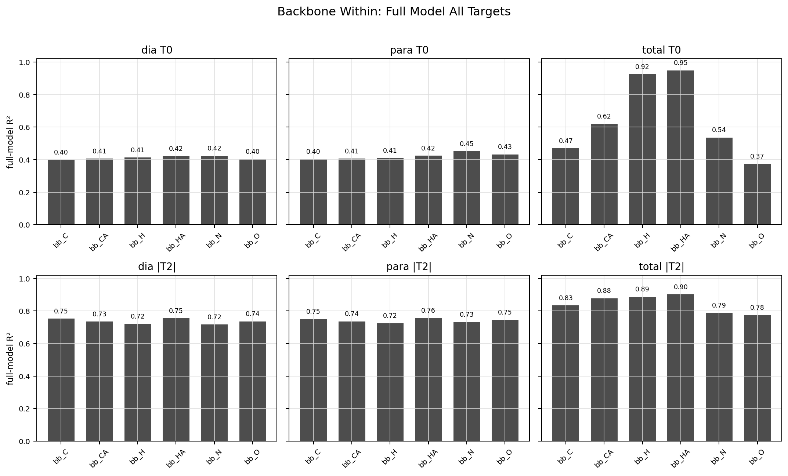

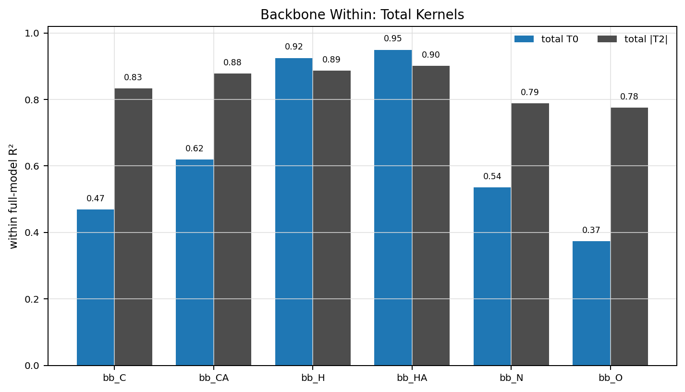

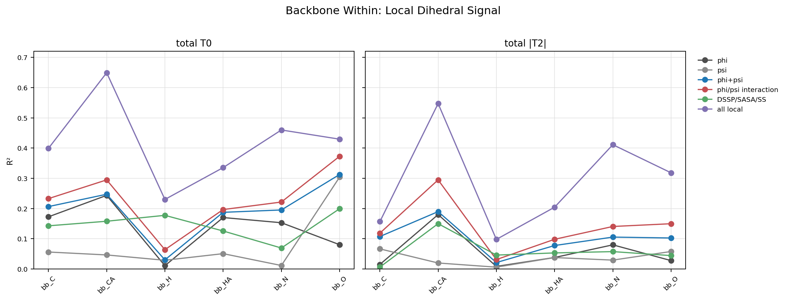

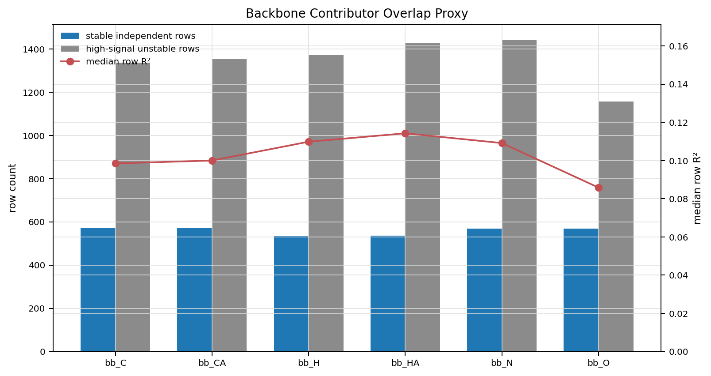

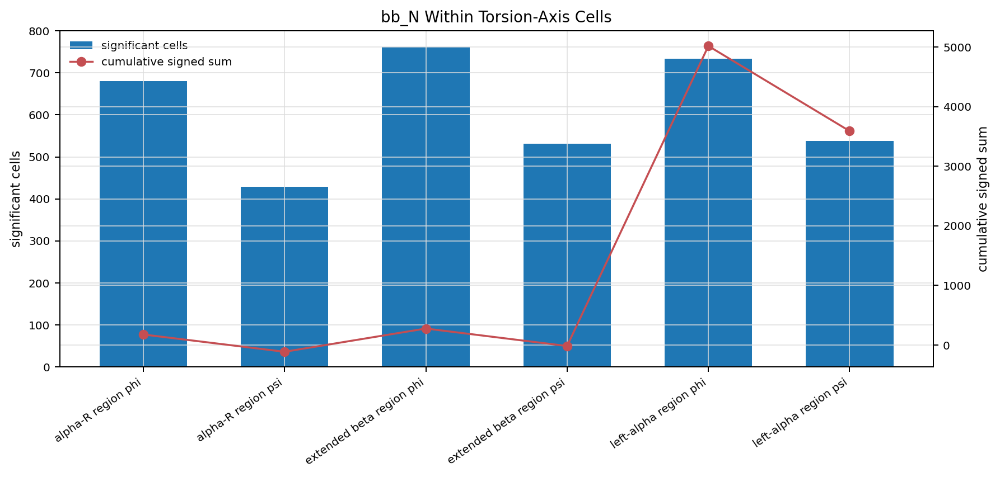

### All Atom

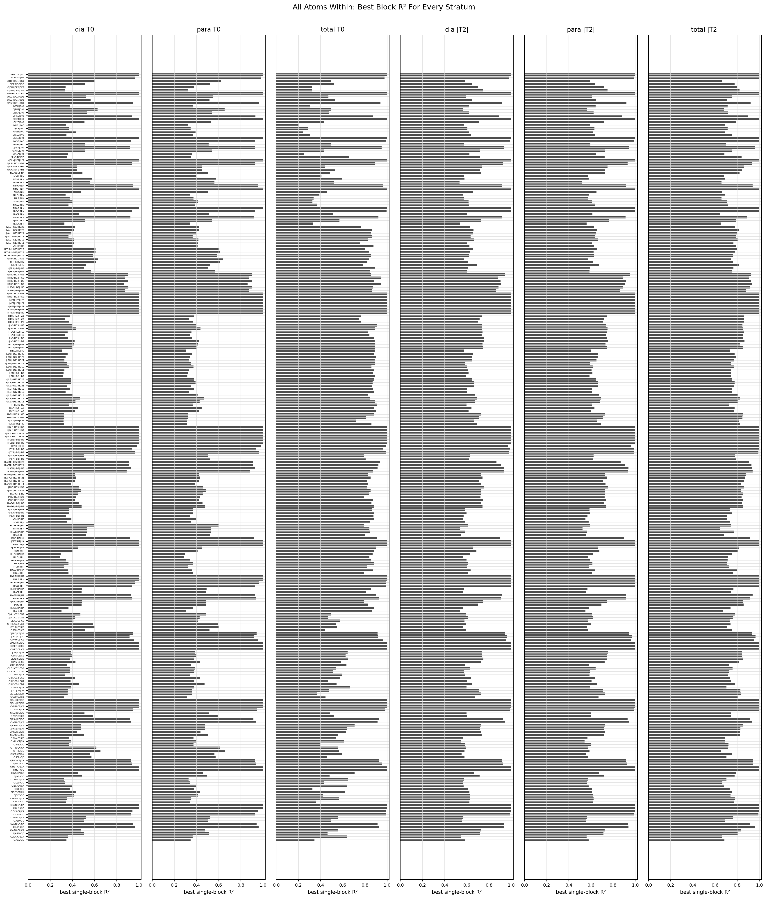

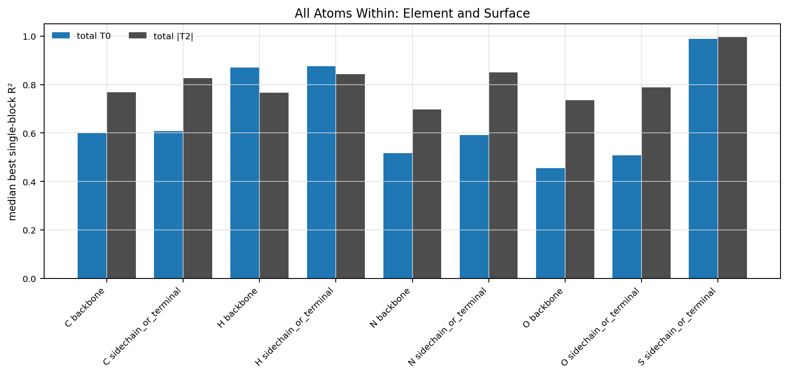

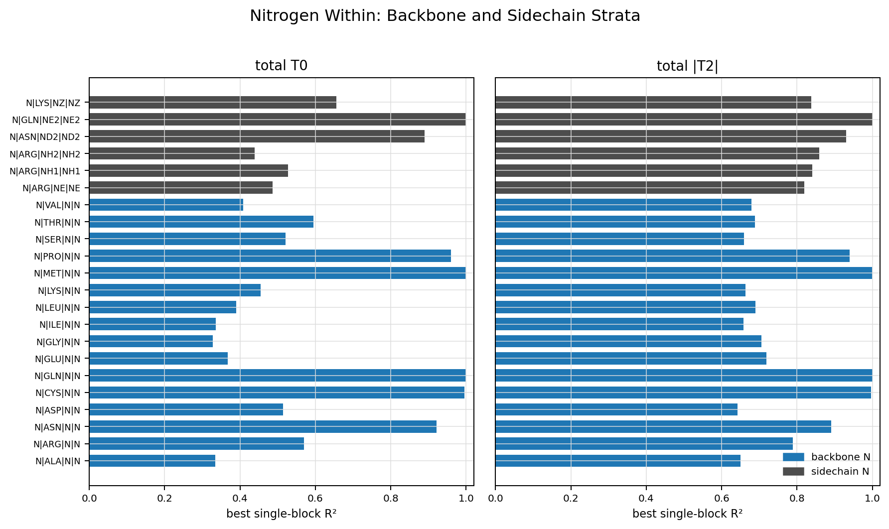

### Contributors

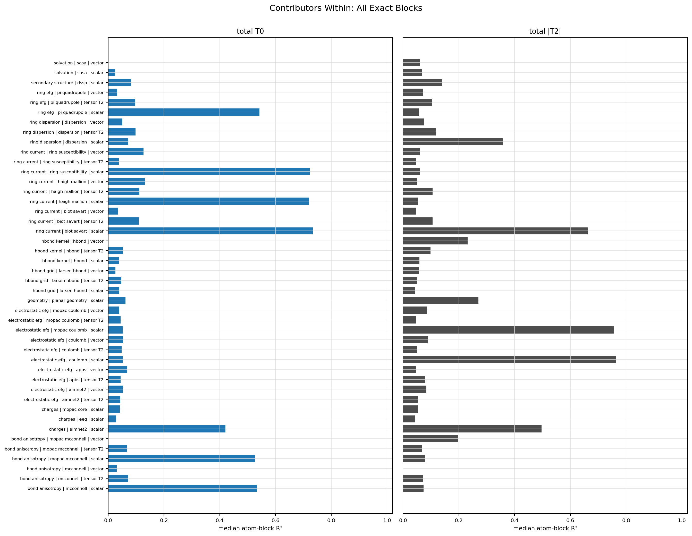

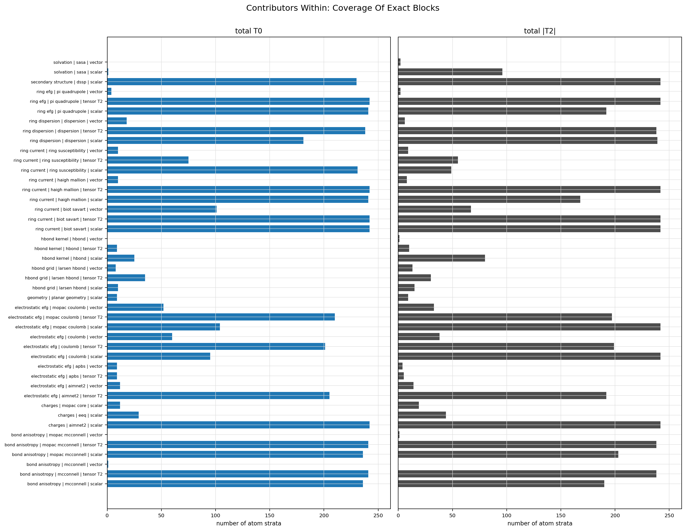

### Stage 2 and Rings

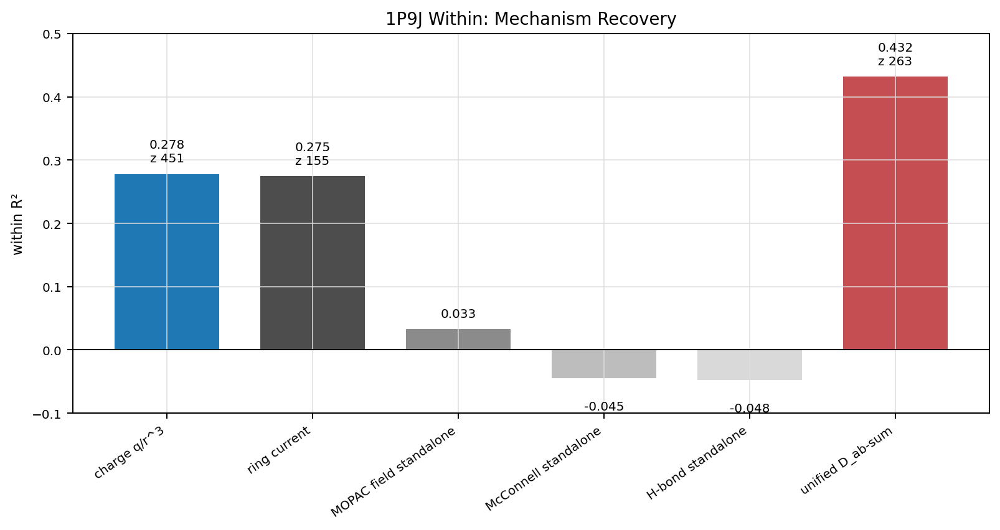

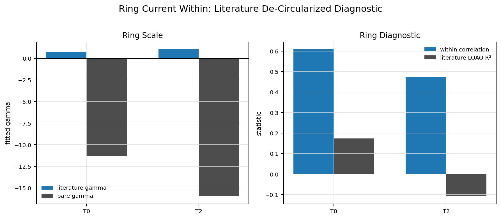
