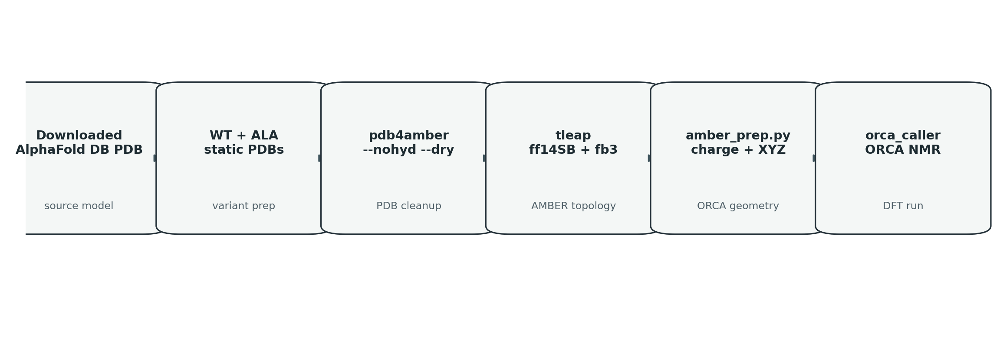
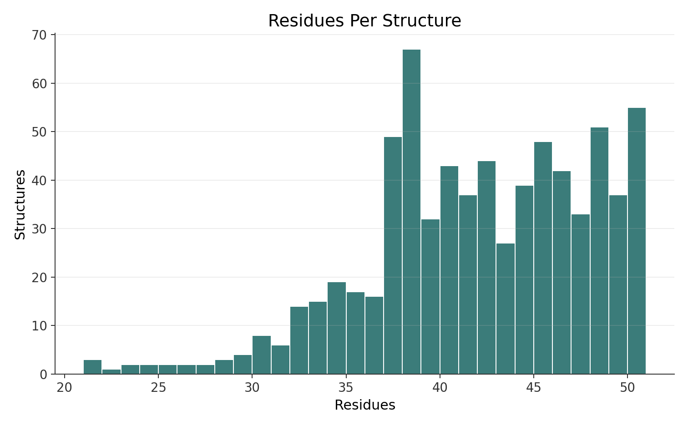
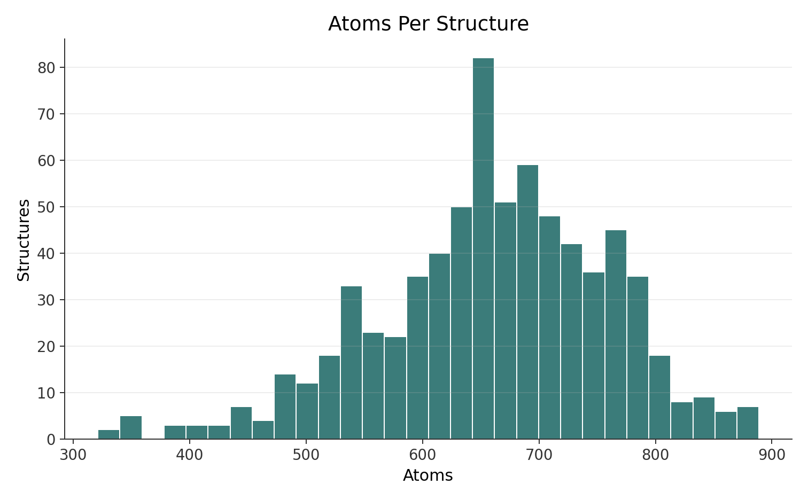

# ORCA DFT Runs: Stage-1 WT+ALA 720

## Dataset Identity

- Structure source: downloaded AlphaFold DB models
- Dataset scope: Stage-1 WT+ALA static-mutant set
- Unit: per AlphaFold structure
- Size source: `/shared/2026Thesis/nmr-shielding/calibration/features/Stage1BMRB_20260513_topology/*/extraction_manifest.json`
- ORCA artifact source: `/shared/2026Thesis/shielding-calcsets/data/orca-alphafold-and-mutants/manifest.json`

## Pair Count

| Count | Value | Source |
|---|---:|---|
| Stage-1 AlphaFold structures | 720 | `/shared/2026Thesis/nmr-shielding/calibration/features/Stage1BMRB_20260513_topology` |
| Stage-1 proteins | 720 | `/shared/2026Thesis/nmr-shielding/calibration/features/Stage1BMRB_20260513_topology` |
| Stage-1 WT+ALA complete pairs | 720/720 | `/shared/2026Thesis/shielding-calcsets/data/orca-alphafold-and-mutants/manifest.json` + `/shared/2026Thesis/nmr-shielding/calibration/features/Stage1BMRB_20260513_topology` |
| Stage-1 IDs present in ORCA manifest | 720/720 | `/shared/2026Thesis/shielding-calcsets/data/orca-alphafold-and-mutants/manifest.json` + `/shared/2026Thesis/nmr-shielding/calibration/features/Stage1BMRB_20260513_topology` |
| ORCA mirror protein entries (superset) | 733 | `/shared/2026Thesis/shielding-calcsets/data/orca-alphafold-and-mutants/manifest.json` |
| ORCA mirror complete WT+ALA outputs | 728/733 | `/shared/2026Thesis/shielding-calcsets/data/orca-alphafold-and-mutants/manifest.json` |
| Stage-1 export protein rows | 720 | `/mnt/expansion/nmr-shielding-release-cleanup-20260528/learn/src/output/actual_physics/stage1_bmrb_r_export_720_20260510/protein_meta.csv` |
| Stage-1 matched atom rows | 425,599 | `/mnt/expansion/nmr-shielding-release-cleanup-20260528/learn/src/output/actual_physics/stage1_bmrb_r_export_720_20260510/protein_meta.csv` |

## Prep Chart

## Prep Steps

- Downloaded AlphaFold DB PDB
- WT/ALA static inputs — `dft-pipeline/src/worker.rs:222-258`
- `pdb4amber --nohyd --dry` — `dft-pipeline/src/prep.rs:6-25`
- `tleap` with `leaprc.protein.ff14SB` + `leaprc.water.fb3` — `dft-pipeline/src/prep.rs:38-59`; `/shared/2026Thesis/shielding-calcsets/data/orca-alphafold-and-mutants/A0A062V9G2/A0A062V9G2_WT_tleap.in:1-5`
- `amber_prep.py` charge extraction + protonated PDB + XYZ — `dft-pipeline/scripts/amber_prep.py:20-99`
- `orca_caller` input generation + ORCA run — `1p9j-orcas/campaign/orca_caller.c:302-312`; `/shared/2026Thesis/shielding-calcsets/data/orca-alphafold-and-mutants/A0A062V9G2/A0A062V9G2_WT_20260319_155239_nmr.out:223-230`

## Size Charts

## Size Summary

| Metric | Min | Median | Mean | Max | Total | Source |
|---|---:|---:|---:|---:|---:|---|
| Residues per structure | 21 | 42.0 | 41.59 | 50 | 29,944 | `/shared/2026Thesis/nmr-shielding/calibration/features/Stage1BMRB_20260513_topology/*/extraction_manifest.json:axis_sizes.residue` |
| Atoms per structure | 321 | 662.5 | 659.88 | 889 | 475,116 | `/shared/2026Thesis/nmr-shielding/calibration/features/Stage1BMRB_20260513_topology/*/extraction_manifest.json:axis_sizes.atom` |

## Backing CSV

| File | Rows | Columns | Source |
|---|---:|---|---|
| `per_alphafold_sizes.csv` | 720 | `structure_id,residues,atoms,afdb_accession` | `/shared/2026Thesis/nmr-shielding/calibration/features/Stage1BMRB_20260513_topology/*/extraction_manifest.json` |

## DFT Settings

- ORCA version: `6.1.1` — `/shared/2026Thesis/shielding-calcsets/data/orca-alphafold-and-mutants/A0A062V9G2/A0A062V9G2_WT_20260319_155239_nmr.out:54-56`; `/shared/2026Thesis/shielding-calcsets/data/orca-alphafold-and-mutants/A0A062V9G2/A0A062V9G2_ALA_20260319_155242_nmr.out:54-56`
- Functional: `r2SCAN` — `/shared/2026Thesis/shielding-calcsets/data/orca-alphafold-and-mutants/A0A062V9G2/A0A062V9G2_WT_20260319_155239_nmr.out:223`; `/shared/2026Thesis/shielding-calcsets/data/orca-alphafold-and-mutants/A0A062V9G2/A0A062V9G2_ALA_20260319_155242_nmr.out:223`
- Basis: `def2-SVP` — `/shared/2026Thesis/shielding-calcsets/data/orca-alphafold-and-mutants/A0A062V9G2/A0A062V9G2_WT_20260319_155239_nmr.out:223`; `/shared/2026Thesis/shielding-calcsets/data/orca-alphafold-and-mutants/A0A062V9G2/A0A062V9G2_ALA_20260319_155242_nmr.out:223`
- Auxiliary basis: `def2/J` — `/shared/2026Thesis/shielding-calcsets/data/orca-alphafold-and-mutants/A0A062V9G2/A0A062V9G2_WT_20260319_155239_nmr.out:223`; `/shared/2026Thesis/shielding-calcsets/data/orca-alphafold-and-mutants/A0A062V9G2/A0A062V9G2_ALA_20260319_155242_nmr.out:223`
- Solvation: `CPCM(Water)` — `/shared/2026Thesis/shielding-calcsets/data/orca-alphafold-and-mutants/A0A062V9G2/A0A062V9G2_WT_20260319_155239_nmr.out:223`; `/shared/2026Thesis/shielding-calcsets/data/orca-alphafold-and-mutants/A0A062V9G2/A0A062V9G2_ALA_20260319_155242_nmr.out:223`
- NMR keyword: `NMR` + `%eprnmr TAU DOBSON` — `/shared/2026Thesis/shielding-calcsets/data/orca-alphafold-and-mutants/A0A062V9G2/A0A062V9G2_WT_20260319_155239_nmr.out:223,227-229`; `/shared/2026Thesis/shielding-calcsets/data/orca-alphafold-and-mutants/A0A062V9G2/A0A062V9G2_ALA_20260319_155242_nmr.out:223,227-229`
- Run controls observed: `%maxcore 8000`, `%pal nprocs 6`, `%scf MaxIter 300` — `/shared/2026Thesis/shielding-calcsets/data/orca-alphafold-and-mutants/A0A062V9G2/A0A062V9G2_WT_20260319_155239_nmr.out:224-226`; `/shared/2026Thesis/shielding-calcsets/data/orca-alphafold-and-mutants/A0A062V9G2/A0A062V9G2_ALA_20260319_155242_nmr.out:224-226`
- Charge/multiplicity echo: `* xyzfile -5 1 ...` — `/shared/2026Thesis/shielding-calcsets/data/orca-alphafold-and-mutants/A0A062V9G2/A0A062V9G2_WT_20260319_155239_nmr.out:230`; `/shared/2026Thesis/shielding-calcsets/data/orca-alphafold-and-mutants/A0A062V9G2/A0A062V9G2_ALA_20260319_155242_nmr.out:230`

## Evidence Paths

| Evidence | Path |
|---|---|
| Prior provenance | `doc/thesis-overview/PROVENANCE_dft_runs_2026-06-04.md` |
| Stage-1 feature manifests | `/shared/2026Thesis/nmr-shielding/calibration/features/Stage1BMRB_20260513_topology/*/extraction_manifest.json` |
| Stage-1 export table | `/mnt/expansion/nmr-shielding-release-cleanup-20260528/learn/src/output/actual_physics/stage1_bmrb_r_export_720_20260510/protein_meta.csv` |
| ORCA WT+ALA manifest | `/shared/2026Thesis/shielding-calcsets/data/orca-alphafold-and-mutants/manifest.json` |
| Stage-1 audit baseline | `/mnt/expansion/nmr-shielding-release-cleanup-20260528/learn/stage1-atom-audit/STAGE1_720_BASELINE_2026-05-10.md` |
| Stage-1 audit findings | `/mnt/expansion/nmr-shielding-release-cleanup-20260528/learn/stage1-atom-audit/STAGE1_720_FINDINGS_2026-05-09.md` |
| Local nmr-720 features | `/shared/2026Thesis/nmr-720/calibration`, `/shared/2026Thesis/nmr-720/baseline_features`, `/shared/2026Thesis/nmr-720/artifacts` |
| AlphaFold/ORCA mirror metadata | `/shared/2026Thesis/shielding-calcsets/data/orca-alphafold-and-mutants/manifest.json`; `/shared/2026Thesis/shielding-calcsets/data/orca-alphafold-and-mutants/*/metadata.json` |
