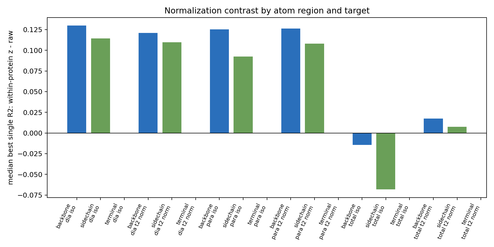
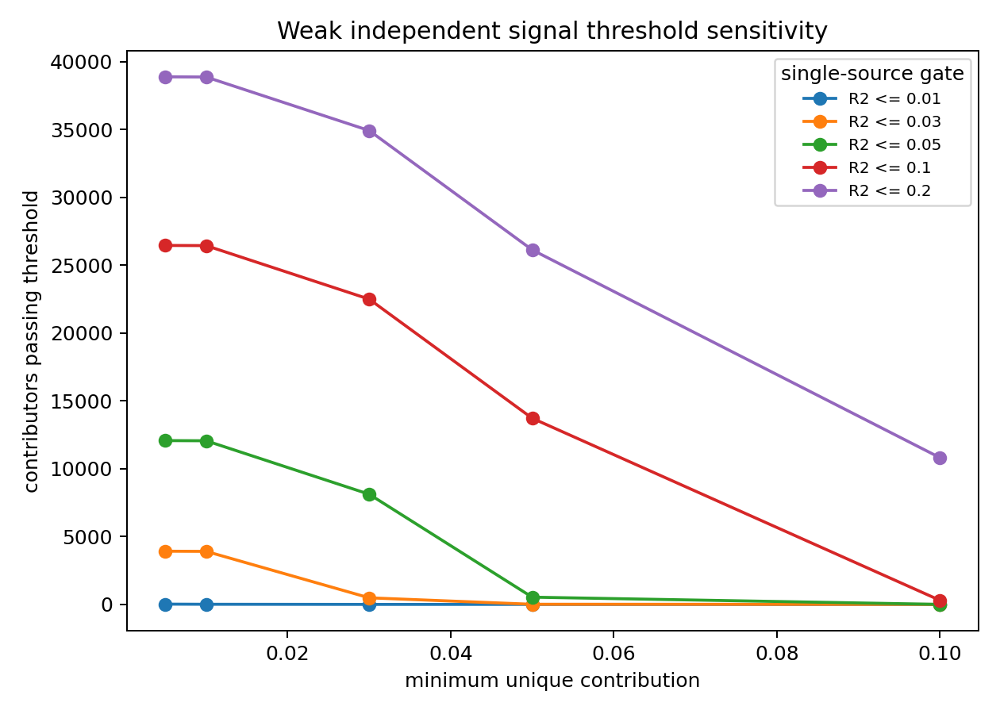
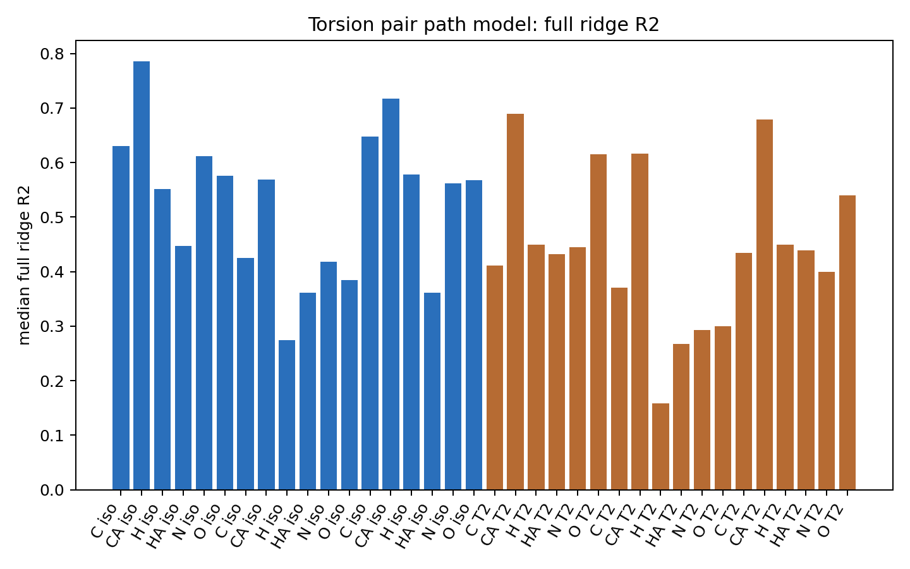

# Stage-1 Statistical Methodology And Results

Source root: `S1=/mnt/expansion/nmr-shielding-release-cleanup-20260528/learn/stage1-topology-workup-20260514`.

This write-up reports Stage-1 diagnostic statistics over geometric kernels and ORCA shielding targets. The fitted values are kernel-vs-ORCA shielding correlations. They are not calibrated shielding laws, and `R^2` is a diagnostic statistic rather than the Stage-1/Stage-2 physical objective. `raw` in these tables means global column z-scaling; it is not unscaled physical units. Sources: `S1/R/matrix_common.R`, `S1/docs/STAGE1_COMPENDIUM.md`, `S1/docs/ATOM_SIGNAL_QUESTION_TABLES.md`, `S1/docs/ADVERSARIAL_AUDIT.md`, `S1/docs/ANALYSIS_OPERATING_NOTES.md`.

Shared scaling and fit definitions:

$$
z_{ij} =
\begin{cases}
(x_{ij}-\bar{x}_j)/s_j, & n_{\mathrm{finite},j}\ge 3,\ s_j>0\\
0, & \text{otherwise}
\end{cases}
$$

Within-protein z uses the same rule inside each protein:

$$
z^{(p)}_{ij} = (x_{ij}-\bar{x}_{p,j})/s_{p,j}.
$$

Ridge prediction and diagnostic fit:

$$
\hat{\beta}_{\lambda}=(X^\top X+\lambda I)^{-1}X^\top y,\qquad
\hat{y}=X\hat{\beta}_{\lambda}
$$

$$
R^2=1-\frac{\sum_i(y_i-\hat{y}_i)^2}{\sum_i(y_i-\bar{y})^2}.
$$

## `01_block_ridge.R` - Block Ridge Signal Capture

**What it tests.** For each named atom stratum, normalization, ORCA target, and exact calculator block, it asks whether that block's geometric-kernel columns linearly capture target variation.

**Estimator.** For one block \(b\), fit

$$
\hat{y}_{b}=X_b(X_b^\top X_b+\lambda I)^{-1}X_b^\top y,\qquad \lambda=0.01.
$$

The stored statistic is \(R^2(y,\hat{y}_b)\). Sources: `S1/R/01_block_ridge.R`, `S1/R/matrix_common.R`, `S1/derived/tables/block_ridge_r2.csv`.

**Result.** The table contains 138,744 block-ridge rows, split evenly across six ORCA target summaries and two normalizations.

| normalization | target_id | n_rows | median_r2 | q90_r2 | max_r2 |
|---|---:|---:|---:|---:|---:|
| raw | dia_iso | 11,562 | 0.022 | 0.152 | 0.999 |
| raw | dia_t2_norm | 11,562 | 0.024 | 0.358 | 1.000 |
| raw | para_iso | 11,562 | 0.022 | 0.158 | 0.999 |
| raw | para_t2_norm | 11,562 | 0.024 | 0.359 | 1.000 |
| raw | total_iso | 11,562 | 0.029 | 0.526 | 1.000 |
| raw | total_t2_norm | 11,562 | 0.042 | 0.581 | 1.000 |
| within_protein_z | dia_iso | 11,562 | 0.026 | 0.171 | 1.000 |
| within_protein_z | dia_t2_norm | 11,562 | 0.024 | 0.312 | 1.000 |
| within_protein_z | para_iso | 11,562 | 0.027 | 0.173 | 1.000 |
| within_protein_z | para_t2_norm | 11,562 | 0.025 | 0.316 | 1.000 |
| within_protein_z | total_iso | 11,562 | 0.023 | 0.426 | 1.000 |
| within_protein_z | total_t2_norm | 11,562 | 0.027 | 0.369 | 1.000 |

**What it proves / does not prove.** It proves that many exact geometric-kernel blocks contain linearly recoverable signal for ORCA shielding targets in the matched Stage-1 atom rows. It does not prove that a block is a calibrated physical shielding law, that the fitted block is used by later models, or that high apparent \(R^2\) survives protein-level holdout.

## `02_mechanism_independence.R` - Drop-One Mechanism Independence

**What it tests.** For each named atom stratum, it asks how much diagnostic \(R^2\) is uniquely lost when one mechanism family is removed from the all-feature ridge fit.

**Estimator.**

$$
R^2_{\mathrm{full}}=R^2(X_{\mathrm{all}},y)
$$

$$
\Delta R^2_m=R^2_{\mathrm{full}}-R^2(X_{\mathrm{all}\setminus m},y)
$$

$$
\mathrm{redundancy\ gap}_m=R^2(X_m,y)-\Delta R^2_m.
$$

Sources: `S1/R/02_mechanism_independence.R`, `S1/derived/tables/mechanism_independence.csv`, `S1/derived/tables/mechanism_independence_summary.csv`.

**Result.** Top mechanism by median unique \(\Delta R^2\) in each normalization/target cell:

| normalization | target_id | mechanism | median_unique_delta_r2 | best_unique_delta_r2 | median_marginal_r2 | best_marginal_r2 |
|---|---|---|---:|---:|---:|---:|
| raw | dia_iso | charges | 0.085 | 0.129 | 0.394 | 0.999 |
| raw | dia_t2_norm | charges | 0.048 | 0.087 | 0.480 | 1.000 |
| raw | para_iso | charges | 0.083 | 0.131 | 0.409 | 0.999 |
| raw | para_t2_norm | charges | 0.047 | 0.090 | 0.485 | 1.000 |
| raw | total_iso | ring_current | 0.009 | 0.075 | 0.928 | 0.998 |
| raw | total_t2_norm | ring_current | 0.013 | 0.044 | 0.880 | 0.998 |
| within_protein_z | dia_iso | charges | 0.125 | 0.246 | 0.489 | 1.000 |
| within_protein_z | dia_t2_norm | electrostatic_efg | 0.052 | 0.106 | 0.716 | 1.000 |
| within_protein_z | para_iso | charges | 0.124 | 0.231 | 0.497 | 1.000 |
| within_protein_z | para_t2_norm | electrostatic_efg | 0.049 | 0.100 | 0.714 | 1.000 |
| within_protein_z | total_iso | ring_current | 0.050 | 0.116 | 0.836 | 0.974 |
| within_protein_z | total_t2_norm | electrostatic_efg | 0.052 | 0.108 | 0.827 | 0.999 |

Counts above two displayed unique-signal thresholds:

| normalization | target_id | n_rows | n_unique_ge_0_01 | n_unique_ge_0_05 | median_redundancy_gap |
|---|---:|---:|---:|---:|---:|
| raw | dia_iso | 2,706 | 1,434 | 456 | 0.123 |
| raw | dia_t2_norm | 2,706 | 1,203 | 180 | 0.189 |
| raw | para_iso | 2,706 | 1,424 | 450 | 0.125 |
| raw | para_t2_norm | 2,706 | 1,189 | 189 | 0.194 |
| raw | total_iso | 2,706 | 540 | 76 | 0.224 |
| raw | total_t2_norm | 2,706 | 511 | 6 | 0.363 |
| within_protein_z | dia_iso | 2,706 | 1,088 | 425 | 0.124 |
| within_protein_z | dia_t2_norm | 2,706 | 832 | 294 | 0.144 |
| within_protein_z | para_iso | 2,706 | 1,089 | 421 | 0.126 |
| within_protein_z | para_t2_norm | 2,706 | 832 | 281 | 0.147 |
| within_protein_z | total_iso | 2,706 | 691 | 221 | 0.131 |
| within_protein_z | total_t2_norm | 2,706 | 601 | 153 | 0.169 |

**What it proves / does not prove.** It proves that several mechanism families add unique diagnostic signal after the other features are present, and that the unique mechanism differs by target and normalization. It does not prove separable physics: a drop-one \(\Delta R^2\) is a fitted covariance diagnostic, and redundancy gaps show overlap among source families.

## `07_mechanism_blocked_cv.R` - Protein-Blocked Mechanism CV

**What it tests.** It asks whether mechanism-level signal survives out-of-protein evaluation by holding out whole proteins.

**Estimator.** Protein IDs are assigned to cyclic folds. For each fold \(k\), fit ridge on proteins not in \(k\), predict held-out proteins, then compute one pooled \(R^2_{\mathrm{CV}}\). For raw/global-z, scaling is fit on train and applied to test; for within-protein z, scaling is computed inside each protein. Sources: `S1/R/07_mechanism_blocked_cv.R`, `S1/derived/tables/mechanism_blocked_cv.csv`, `S1/derived/tables/mechanism_blocked_cv_summary.csv`.

**Result.** Top mechanism by median protein-blocked CV \(R^2\):

| normalization | target_id | mechanism | median_apparent_marginal_r2 | median_protein_blocked_cv_r2 | q90_protein_blocked_cv_r2 | best_protein_blocked_cv_r2 | median_cv_minus_apparent_r2 |
|---|---|---|---:|---:|---:|---:|---:|
| raw | dia_iso | secondary_structure | 0.121 | 0.095 | 0.166 | 0.239 | -0.026 |
| raw | dia_t2_norm | electrostatic_efg | 0.596 | 0.437 | 0.554 | 0.677 | -0.134 |
| raw | para_iso | secondary_structure | 0.121 | 0.094 | 0.167 | 0.414 | -0.026 |
| raw | para_t2_norm | electrostatic_efg | 0.588 | 0.429 | 0.539 | 0.654 | -0.141 |
| raw | total_iso | bond_anisotropy | 0.743 | 0.596 | 0.928 | 0.975 | -0.088 |
| raw | total_t2_norm | electrostatic_efg | 0.736 | 0.563 | 0.690 | 0.872 | -0.153 |
| within_protein_z | dia_iso | secondary_structure | 0.179 | 0.105 | 0.211 | 0.592 | -0.041 |
| within_protein_z | dia_t2_norm | electrostatic_efg | 0.716 | 0.547 | 0.712 | 0.794 | -0.088 |
| within_protein_z | para_iso | secondary_structure | 0.182 | 0.107 | 0.210 | 0.592 | -0.042 |
| within_protein_z | para_t2_norm | electrostatic_efg | 0.714 | 0.553 | 0.713 | 0.803 | -0.086 |
| within_protein_z | total_iso | ring_current | 0.836 | 0.451 | 0.853 | 0.891 | -0.262 |
| within_protein_z | total_t2_norm | electrostatic_efg | 0.827 | 0.700 | 0.831 | 0.896 | -0.060 |

**What it proves / does not prove.** It proves that some mechanism-level geometric kernels retain predictive signal across protein-held-out folds, especially T2 targets. It does not prove between-protein calibration or pointwise shielding accuracy; it is a stability diagnostic over the same Stage-1 feature/target export.

## `09_top20_pairwise_independence.R` - Surface-Level Pairwise Tests

**What it tests.** Among the top-20 block types per atom surface, normalization, and target, it asks whether two fitted block signals add information beyond the better single block.

**Estimator.** For fitted one-dimensional block signals \(\hat{y}_a,\hat{y}_b\):

$$
R^2_{ab}=R^2([\hat{y}_a,\hat{y}_b],y)
$$

$$
\mathrm{overlap}=R^2_a+R^2_b-R^2_{ab},\qquad
\mathrm{gain}=R^2_{ab}-\max(R^2_a,R^2_b).
$$

Sources: `S1/R/09_top20_pairwise_independence.R`, `S1/derived/tables/core_top20_block_pairwise_independence_summary.csv`.

**Result.**

| atom_surface | normalization | target_id | n_pairs | median_pair_r2 | max_pair_r2 | median_gain_over_best | max_gain_over_best | median_overlap_estimate |
|---|---|---|---:|---:|---:|---:|---:|---:|
| backbone | raw | dia_iso | 190 | 0.035 | 0.260 | 0.003 | 0.064 | 0.002 |
| backbone | raw | dia_t2_norm | 190 | 0.106 | 0.520 | 0.003 | 0.048 | 0.005 |
| backbone | raw | para_iso | 190 | 0.050 | 0.265 | 0.003 | 0.065 | 0.002 |
| backbone | raw | para_t2_norm | 190 | 0.098 | 0.511 | 0.003 | 0.053 | 0.005 |
| backbone | raw | total_iso | 190 | 0.015 | 0.129 | 0.003 | 0.046 | 0.000 |
| backbone | raw | total_t2_norm | 190 | 0.107 | 0.501 | 0.003 | 0.125 | 0.006 |
| backbone | within_protein_z | dia_iso | 190 | 0.051 | 0.250 | 0.004 | 0.060 | 0.002 |
| backbone | within_protein_z | dia_t2_norm | 190 | 0.115 | 0.681 | 0.005 | 0.059 | 0.012 |
| backbone | within_protein_z | para_iso | 190 | 0.078 | 0.257 | 0.004 | 0.071 | 0.002 |
| backbone | within_protein_z | para_t2_norm | 190 | 0.106 | 0.681 | 0.005 | 0.066 | 0.012 |
| backbone | within_protein_z | total_iso | 190 | 0.025 | 0.180 | 0.004 | 0.063 | 0.001 |
| backbone | within_protein_z | total_t2_norm | 190 | 0.114 | 0.630 | 0.006 | 0.125 | 0.012 |
| sidechain_or_terminal | raw | dia_iso | 190 | 0.058 | 0.237 | 0.002 | 0.060 | 0.001 |
| sidechain_or_terminal | raw | dia_t2_norm | 190 | 0.157 | 0.554 | 0.003 | 0.039 | 0.008 |
| sidechain_or_terminal | raw | para_iso | 190 | 0.054 | 0.231 | 0.002 | 0.058 | 0.001 |
| sidechain_or_terminal | raw | para_t2_norm | 190 | 0.150 | 0.544 | 0.003 | 0.043 | 0.007 |
| sidechain_or_terminal | raw | total_iso | 190 | 0.048 | 0.273 | 0.001 | 0.062 | 0.001 |
| sidechain_or_terminal | raw | total_t2_norm | 190 | 0.139 | 0.538 | 0.002 | 0.154 | 0.004 |
| sidechain_or_terminal | within_protein_z | dia_iso | 190 | 0.074 | 0.238 | 0.002 | 0.075 | 0.001 |
| sidechain_or_terminal | within_protein_z | dia_t2_norm | 190 | 0.174 | 0.716 | 0.003 | 0.050 | 0.008 |
| sidechain_or_terminal | within_protein_z | para_iso | 190 | 0.072 | 0.224 | 0.002 | 0.074 | 0.001 |
| sidechain_or_terminal | within_protein_z | para_t2_norm | 190 | 0.162 | 0.711 | 0.003 | 0.062 | 0.007 |
| sidechain_or_terminal | within_protein_z | total_iso | 190 | 0.133 | 0.267 | 0.001 | 0.084 | 0.001 |
| sidechain_or_terminal | within_protein_z | total_t2_norm | 190 | 0.174 | 0.615 | 0.002 | 0.103 | 0.006 |

**What it proves / does not prove.** It proves that fitted block signals have measurable pairwise gain and overlap at the backbone versus sidechain/terminal surface level. It does not prove atom-specific independence, because this method pools within surface; the named-atom test below carries that finer unit.

## `12_atom_pairwise_independence.R` - Named-Atom Pairwise Tests

**What it tests.** For each named atom, normalization, and target, it refits the top-20 block signals and computes pairwise gain, overlap, unique-a-given-b, and unique-b-given-a.

**Estimator.**

$$
\mathrm{unique}_{a|b}=R^2_{ab}-R^2_b,\qquad
\mathrm{unique}_{b|a}=R^2_{ab}-R^2_a.
$$

Sources: `S1/R/12_atom_pairwise_independence.R`, `S1/derived/tables/core_block_pairwise_independence_top20_by_atom.csv`, `S1/derived/tables/core_atom_top20_signal_landscape.csv`.

**Result.** Median `max_gain_over_best` for total targets by emitted atom-role label:

| atom_role_label | atom_region | element_symbol | n_named_atoms | raw total_iso | raw total_t2_norm | within total_iso | within total_t2_norm |
|---|---|---|---:|---:|---:|---:|---:|
| bb_C | backbone | C | 16 | 0.152 | 0.132 | 0.149 | 0.106 |
| bb_CA | backbone | C | 16 | 0.139 | 0.171 | 0.112 | 0.121 |
| bb_H | backbone | H | 15 | 0.130 | 0.170 | 0.088 | 0.121 |
| bb_HA | backbone | H | 15 | 0.111 | 0.183 | 0.086 | 0.124 |
| bb_N | backbone | N | 16 | 0.126 | 0.178 | 0.152 | 0.132 |
| bb_O | backbone | O | 16 | 0.125 | 0.157 | 0.084 | 0.109 |
| sidechain_C | sidechain | C | 40 | 0.138 | 0.154 | 0.139 | 0.115 |
| sidechain_H | sidechain | H | 92 | 0.109 | 0.152 | 0.101 | 0.118 |
| sidechain_N | sidechain | N | 6 | 0.135 | 0.164 | 0.136 | 0.114 |
| sidechain_O | sidechain | O | 8 | 0.130 | 0.176 | 0.119 | 0.106 |
| sidechain_S | sidechain | S | 2 | 0.141 | 0.204 | 0.182 | 0.160 |
| terminal_H | terminal | H | 3 | 0.133 | 0.178 |  |  |
| terminal_O | terminal | O | 1 | 0.192 | 0.195 |  |  |

**What it proves / does not prove.** It proves that pairwise independence is atom-role dependent, including separate behavior for `bb_N` and `sidechain_N`. It does not prove causal additivity of mechanisms; the pairwise inputs are fitted one-dimensional signals derived from geometric-kernel blocks.

## `15_normalization_contrast.R` - Raw Versus Within-Protein-Z Contrast

**What it tests.** It compares the same named atom, target, and source block under global-z and within-protein-z normalization, without refitting models.

**Estimator.**

$$
\Delta R^2_{\mathrm{zp-raw}}=R^2_{\mathrm{within\ protein\ z}}-R^2_{\mathrm{raw}}.
$$

At source level, the code labels `zp_stronger_r2` and `raw_stronger_r2` when \(|\Delta R^2|\ge 0.03\); this is a table label threshold, not a physical verdict. Sources: `S1/R/15_normalization_contrast.R`, `S1/derived/secondary/tables/norm_contrast_by_atom_source.csv`, `S1/derived/secondary/tables/norm_contrast_landscape_summary.csv`.

**Result.**

| atom_region | target_id | n_named_atom_targets | n_both | median_best_single_r2_zp_minus_raw | median_max_gain_zp_minus_raw | max_abs_best_single_r2_delta |
|---|---|---:|---:|---:|---:|---:|
| backbone | dia_iso | 94 | 94 | 0.130 | -0.001 | 0.522 |
| sidechain | dia_iso | 148 | 148 | 0.114 | -0.010 | 0.517 |
| terminal | dia_iso | 4 | 0 |  |  |  |
| backbone | dia_t2_norm | 94 | 94 | 0.121 | 0.019 | 0.500 |
| sidechain | dia_t2_norm | 148 | 148 | 0.110 | 0.005 | 0.419 |
| terminal | dia_t2_norm | 4 | 0 |  |  |  |
| backbone | para_iso | 94 | 94 | 0.125 | -0.000 | 0.518 |
| sidechain | para_iso | 148 | 148 | 0.092 | -0.010 | 0.516 |
| terminal | para_iso | 4 | 0 |  |  |  |
| backbone | para_t2_norm | 94 | 94 | 0.126 | 0.012 | 0.482 |
| sidechain | para_t2_norm | 148 | 148 | 0.108 | 0.004 | 0.423 |
| terminal | para_t2_norm | 4 | 0 |  |  |  |
| backbone | total_iso | 94 | 94 | -0.014 | -0.017 | 0.606 |
| sidechain | total_iso | 148 | 148 | -0.068 | 0.000 | 0.495 |
| terminal | total_iso | 4 | 0 |  |  |  |
| backbone | total_t2_norm | 94 | 94 | 0.017 | -0.041 | 0.353 |
| sidechain | total_t2_norm | 148 | 148 | 0.008 | -0.035 | 0.229 |
| terminal | total_t2_norm | 4 | 0 |  |  |  |

Chart: 

**What it proves / does not prove.** It proves that within-protein normalization changes the diagnostic signal landscape, especially for component targets. It does not prove that within-protein and between-protein effects are interchangeable; within-protein z intentionally removes protein-level offsets.

## `16_weak_independent_signal.R` - Weak But Independent Signal

**What it tests.** It asks whether low single-block \(R^2\) rows can still add unique signal in pairwise tests.

**Estimator and thresholds.**

Weak independent:

$$
\mathrm{rank}>1,\qquad R^2_{\mathrm{single}}\le 0.10,\qquad
\max_b \mathrm{unique}_{a|b}\ge 0.03.
$$

Tiny independent:

$$
R^2_{\mathrm{single}}\le 0.03,\qquad
\max_b \mathrm{unique}_{a|b}\ge 0.03.
$$

The threshold grid below reports sensitivity across \((R^2_{\max}, \mathrm{unique}_{\min})\). Sources: `S1/R/16_weak_independent_signal.R`, `S1/derived/secondary/tables/weak_independent_contributors.csv`, `S1/derived/secondary/tables/weak_independent_threshold_grid_global.csv`.

**Result.** Class counts:

| weak_signal_class | n |
|---|---:|
| not_weak_independent | 36,066 |
| weak_single_independent_low_cor | 20,564 |
| weak_single_independent | 1,445 |
| tiny_single_independent_low_cor | 480 |
| tiny_single_independent | 5 |

Sensitivity grid:

| r2_max | unique_min | n_contributors | n_named_atom_groups | n_named_atoms | median_single_r2 | median_unique_given_partner |
|---:|---:|---:|---:|---:|---:|---:|
| 0.010 | 0.005 | 20 | 13 | 7 | 0.009 | 0.010 |
| 0.010 | 0.010 | 9 | 8 | 5 | 0.010 | 0.011 |
| 0.010 | 0.030 | 0 | 0 | 0 |  |  |
| 0.010 | 0.050 | 0 | 0 | 0 |  |  |
| 0.010 | 0.100 | 0 | 0 | 0 |  |  |
| 0.030 | 0.005 | 3,920 | 1,054 | 179 | 0.024 | 0.025 |
| 0.030 | 0.010 | 3,908 | 1,054 | 179 | 0.024 | 0.025 |
| 0.030 | 0.030 | 485 | 343 | 143 | 0.028 | 0.032 |
| 0.030 | 0.050 | 9 | 6 | 6 | 0.026 | 0.063 |
| 0.030 | 0.100 | 1 | 1 | 1 | 0.027 | 0.239 |
| 0.050 | 0.005 | 12,071 | 1,941 | 226 | 0.035 | 0.035 |
| 0.050 | 0.010 | 12,059 | 1,941 | 226 | 0.035 | 0.035 |
| 0.050 | 0.030 | 8,119 | 1,903 | 226 | 0.040 | 0.039 |
| 0.050 | 0.050 | 533 | 384 | 170 | 0.047 | 0.053 |
| 0.050 | 0.100 | 2 | 2 | 2 | 0.032 | 0.181 |
| 0.100 | 0.005 | 26,452 | 2,689 | 246 | 0.053 | 0.051 |
| 0.100 | 0.010 | 26,440 | 2,689 | 246 | 0.053 | 0.051 |
| 0.100 | 0.030 | 22,494 | 2,686 | 246 | 0.059 | 0.056 |
| 0.100 | 0.050 | 13,718 | 2,630 | 246 | 0.072 | 0.069 |
| 0.100 | 0.100 | 305 | 217 | 119 | 0.095 | 0.105 |
| 0.200 | 0.005 | 38,877 | 2,884 | 246 | 0.071 | 0.068 |
| 0.200 | 0.010 | 38,865 | 2,884 | 246 | 0.071 | 0.068 |
| 0.200 | 0.030 | 34,918 | 2,884 | 246 | 0.078 | 0.074 |
| 0.200 | 0.050 | 26,125 | 2,868 | 246 | 0.097 | 0.090 |
| 0.200 | 0.100 | 10,817 | 2,515 | 246 | 0.141 | 0.129 |

Chart: 

**What it proves / does not prove.** It proves that small marginal \(R^2\) does not imply absence of independent signal. It does not prove physical importance by amplitude alone, and the weak/tiny labels are thresholded inspection labels.

## `18_tensor_component_split.R` - T0/T2 And Dia/Para/Total Split

**What it tests.** It compares T0-like isotropic targets and T2 tensor-norm targets, and also diamagnetic/paramagnetic/total components, without collapsing T2 into a scalar-only story.

**Estimator.**

For each same named atom/source/normalization row:

$$
\Delta R^2_{\mathrm{total},T2-T0}=R^2_{\mathrm{total\_t2\_norm}}-R^2_{\mathrm{total\_iso}}
$$

$$
\Delta R^2_{\mathrm{dia},T2-T0}=R^2_{\mathrm{dia\_t2\_norm}}-R^2_{\mathrm{dia\_iso}}
$$

$$
\Delta R^2_{\mathrm{para},T2-T0}=R^2_{\mathrm{para\_t2\_norm}}-R^2_{\mathrm{para\_iso}}.
$$

Tensor-specific rows are flagged when the maximum absolute T2-minus-T0 delta is at least 0.05; component-specific rows are flagged when the maximum absolute para-minus-dia delta is at least 0.05. Sources: `S1/R/18_tensor_component_split.R`, `S1/derived/secondary/tables/tensor_component_landscape_summary.csv`, `S1/derived/secondary/tables/tensor_component_top_targets_by_atom_source.csv`.

**Result.**

| normalization | atom_region | n_named_atoms | median_max_best_single_r2 | median_total_t2_minus_t0_best_single_r2 | median_dia_t2_minus_t0_best_single_r2 | median_para_t2_minus_t0_best_single_r2 | median_t0_component_range_best_single_r2 | median_t2_component_range_best_single_r2 |
|---|---:|---:|---:|---:|---:|---:|---:|---:|
| raw | backbone | 94 | 0.802 | 0.114 | 0.132 | 0.123 | 0.219 | 0.223 |
| raw | sidechain | 148 | 0.932 | -0.065 | 0.175 | 0.167 | 0.382 | 0.230 |
| raw | terminal | 4 | 0.967 | -0.090 | 0.013 | 0.013 | 0.251 | 0.137 |
| within_protein_z | backbone | 94 | 0.815 | 0.028 | 0.151 | 0.124 | 0.063 | 0.106 |
| within_protein_z | sidechain | 148 | 0.869 | 0.000 | 0.211 | 0.212 | 0.194 | 0.118 |

Top target distribution among atom/source rows:

| normalization | top_r2_target | n_rows | n_tensor_specific | n_component_specific | median_max_r2 | median_tensor_delta | median_component_delta |
|---|---|---:|---:|---:|---:|---:|---:|
| raw | dia_iso | 493 | 115 | 1 | 0.067 | 0.054 | 0.002 |
| raw | dia_t2_norm | 282 | 109 | 18 | 0.108 | 0.123 | 0.014 |
| raw | para_iso | 448 | 73 | 2 | 0.057 | 0.044 | 0.002 |
| raw | para_t2_norm | 225 | 80 | 21 | 0.077 | 0.051 | 0.006 |
| raw | total_iso | 2,449 | 1,413 | 56 | 0.320 | 0.126 | 0.009 |
| raw | total_t2_norm | 2,584 | 1,722 | 159 | 0.358 | 0.119 | 0.010 |
| within_protein_z | dia_iso | 714 | 162 | 9 | 0.073 | 0.034 | 0.003 |
| within_protein_z | dia_t2_norm | 249 | 42 | 2 | 0.075 | 0.025 | 0.003 |
| within_protein_z | para_iso | 896 | 265 | 12 | 0.083 | 0.039 | 0.004 |
| within_protein_z | para_t2_norm | 325 | 76 | 12 | 0.084 | 0.028 | 0.003 |
| within_protein_z | total_iso | 2,259 | 1,022 | 20 | 0.311 | 0.160 | 0.003 |
| within_protein_z | total_t2_norm | 1,836 | 1,024 | 55 | 0.316 | 0.108 | 0.005 |

**What it proves / does not prove.** It proves that T2 and component behavior are not interchangeable with total-isotropic signal. It does not prove tensor physics by itself; the deltas compare diagnostic \(R^2\) values across targets and components.

## `19_atom_role_stratification.R` - Atom Role And Topology Stratification

**What it tests.** It asks how contributor, pairwise, weak-signal, and landscape summaries differ by emitted atom role and topology labels, preserving backbone, sidechain, terminal, and element strata.

**Estimator.** This is table algebra over the corrected contributor/pairwise/landscape tables:

$$
\mathrm{median}_{g}(R^2_{\mathrm{best}}),\quad
\max_g(R^2_{\mathrm{best}}),\quad
D_{\mathrm{eff}}=\frac{(\sum_i \max(r_i,0))^2}{\sum_i \max(r_i,0)^2}
$$

where \(g\) is the atom-role stratum and \(D_{\mathrm{eff}}\) is the positive top-20 participation statistic. Sources: `S1/R/19_atom_role_stratification.R`, `S1/derived/secondary/tables/role_signal_landscape.csv`, `S1/derived/secondary/tables/role_axis_summary.csv`.

**Result.** Median best single-block \(R^2\) by emitted atom-role label for total targets:

| atom_role_label | atom_region | element_symbol | n_named_atoms | raw total_iso | raw total_t2_norm | within total_iso | within total_t2_norm |
|---|---|---|---:|---:|---:|---:|---:|
| bb_C | backbone | C | 16 | 0.460 | 0.685 | 0.472 | 0.757 |
| bb_CA | backbone | C | 16 | 0.587 | 0.775 | 0.638 | 0.773 |
| bb_H | backbone | H | 15 | 0.925 | 0.795 | 0.848 | 0.743 |
| bb_HA | backbone | H | 15 | 0.942 | 0.815 | 0.879 | 0.800 |
| bb_N | backbone | N | 16 | 0.657 | 0.796 | 0.518 | 0.698 |
| bb_O | backbone | O | 16 | 0.524 | 0.724 | 0.455 | 0.735 |
| sidechain_C | sidechain | C | 40 | 0.549 | 0.802 | 0.565 | 0.828 |
| sidechain_H | sidechain | H | 92 | 0.956 | 0.843 | 0.876 | 0.815 |
| sidechain_N | sidechain | N | 6 | 0.764 | 0.853 | 0.773 | 0.885 |
| sidechain_O | sidechain | O | 8 | 0.655 | 0.774 | 0.512 | 0.793 |
| sidechain_S | sidechain | S | 2 | 0.791 | 0.864 | 0.988 | 0.997 |
| terminal_H | terminal | H | 3 | 0.951 | 0.842 |  |  |
| terminal_O | terminal | O | 1 | 1.000 | 1.000 |  |  |

**What it proves / does not prove.** It proves that atom role and topology labels are central to the Stage-1 signal pattern. It does not support merging nitrogen into one claim: `bb_N` and `sidechain_N` have separate rows and different behavior.

## `45_local_geometry_cloud_probe.R` - Local Geometry Cloud / Shielding-State Association

**What it tests.** In a residue-local N-CA-C frame, it asks which nearby atoms and shells are associated with signed within-protein ORCA shielding z for target backbone atoms.

**Estimator.** Frame:

$$
e_x=\mathrm{unit}(CA-N),\qquad
e_y=\mathrm{unit}\left((C-CA)-[(C-CA)\cdot e_x]e_x\right),\qquad
e_z=e_x\times e_y.
$$

Continuous bins report weighted means:

$$
\bar{z}_{b}=\frac{\sum_{i\in b} z_i}{n_b}.
$$

High/low density contrasts use inclusive quartiles:

$$
P_{\mathrm{high}}(b)=\frac{n_{\mathrm{high}}(b)}{\sum_b n_{\mathrm{high}}(b)},\qquad
P_{\mathrm{low}}(b)=\frac{n_{\mathrm{low}}(b)}{\sum_b n_{\mathrm{low}}(b)}
$$

$$
\Delta P(b)=P_{\mathrm{high}}(b)-P_{\mathrm{low}}(b),\qquad
\log_2\mathrm{HL}(b)=\log_2\frac{P_{\mathrm{high}}(b)+10^{-9}}{P_{\mathrm{low}}(b)+10^{-9}}.
$$

Operational parameters: cutoff 5.50 A, maximum 24 neighbours per target atom, 1.0 A voxel bins, 0.5 A radial bins. Sources: `S1/R/45_local_geometry_cloud_probe.R`, `S1/derived/local_geometry_cloud_probe_20260518_002/LOCAL_GEOMETRY_CLOUD_NOTES.md`, `S1/derived/local_geometry_cloud_probe_20260518_002/geometry_cloud_radial_signal_summary.csv`, `S1/derived/local_geometry_cloud_probe_20260518_002/geometry_cloud_nearest_rank_delta.csv`.

**Result.** Continuous radial rows below are displayed with `n_pairs >= 5,000` and sorted by `max_abs_bin_target_z`; the source CSV contains all rows.

| target_atom_role | target_id | placement_region | neighbour_element | residue_relation | n_radial_bins | n_pairs | n_target_instances | signed_mean_target_z | rms_bin_target_z | max_abs_bin_target_z |
|---|---|---|---|---|---:|---:|---:|---:|---:|---:|
| bb_HA | total_t2_norm | extended_beta_box | C | same_residue | 10 | 57,554 | 40,769 | -0.033 | 0.148 | 6.109 |
| bb_HA | total_t2_norm | extended_beta_box | N | next_residue | 6 | 12,356 | 12,356 | 0.011 | 0.183 | 6.109 |
| bb_C | total_iso | extended_beta_box | H | same_residue | 9 | 61,676 | 39,084 | 0.057 | 0.077 | 6.071 |
| bb_HA | total_iso | extended_beta_box | C | same_residue | 10 | 57,554 | 40,769 | -0.200 | 0.235 | 5.933 |
| bb_HA | total_iso | extended_beta_box | N | next_residue | 6 | 12,356 | 12,356 | -0.236 | 0.307 | 5.933 |
| bb_HA | total_t2_norm | extended_beta_box | O | same_residue | 7 | 15,330 | 14,543 | -0.005 | 0.106 | 5.772 |
| bb_HA | total_iso | extended_beta_box | O | same_residue | 7 | 15,330 | 14,543 | -0.292 | 0.315 | 5.544 |
| bb_C | total_iso | alpha_R_box | H | next_residue | 8 | 38,993 | 36,814 | -0.099 | 0.250 | 4.987 |
| bb_C | total_t2_norm | alpha_R_box | H | next_residue | 8 | 38,993 | 36,814 | -0.183 | 0.190 | 4.878 |
| bb_N | total_iso | alpha_R_box | H | previous_residue | 7 | 46,668 | 23,914 | -0.008 | 0.131 | 4.608 |
| bb_CA | total_iso | alpha_R_box | H | same_residue | 9 | 84,157 | 45,350 | -0.438 | 0.513 | 4.461 |
| bb_CA | total_t2_norm | alpha_R_box | H | same_residue | 9 | 84,157 | 45,350 | -0.315 | 0.354 | 3.787 |

Nearest-rank high-minus-low rows below are displayed with `n_pairs_total >= 1,000` and sorted by \(|\Delta P|\):

| target_atom_role | target_id | neighbour_rank | neighbour_element | residue_relation | n_pairs_high | n_pairs_low | probability_delta_high_low | log2_high_low | n_pairs_total |
|---|---|---:|---|---|---:|---:|---:|---:|---:|
| bb_H | total_iso | 2 | C | previous_residue | 6,704 | 718 | 0.036 | 3.224 | 7,422 |
| bb_H | total_iso | 3 | C | previous_residue | 187 | 6,088 | -0.036 | -5.024 | 6,275 |
| bb_O | total_t2_norm | 2 | H | distant_sequence | 383 | 6,330 | -0.035 | -4.047 | 6,713 |
| bb_O | total_t2_norm | 2 | N | next_residue | 6,404 | 503 | 0.035 | 3.671 | 6,907 |
| bb_H | total_iso | 2 | O | distant_sequence | 1 | 5,488 | -0.033 | -12.421 | 5,489 |
| bb_O | total_t2_norm | 3 | N | next_residue | 715 | 6,365 | -0.033 | -3.154 | 7,080 |
| bb_O | total_t2_norm | 3 | C | same_residue | 5,827 | 272 | 0.032 | 4.421 | 6,099 |
| bb_H | total_iso | 3 | C | same_residue | 4,699 | 84 | 0.028 | 5.806 | 4,783 |
| bb_CA | total_iso | 14 | H | same_residue | 1,184 | 5,697 | -0.026 | -2.266 | 6,881 |
| bb_H | total_t2_norm | 2 | C | previous_residue | 2,465 | 6,588 | -0.025 | -1.418 | 9,053 |
| bb_H | total_t2_norm | 3 | C | previous_residue | 4,353 | 302 | 0.024 | 3.849 | 4,655 |
| bb_CA | total_iso | 7 | O | same_residue | 148 | 4,255 | -0.024 | -4.845 | 4,403 |

**What it proves / does not prove.** It proves that local neighbour geometry is statistically associated with within-protein ORCA shielding states in residue-local coordinates. It does not prove neighbour causality or a calibrated local physical law; middle shielding values are retained in the continuous summaries, and high/low quartiles are visualization/contrast classes.

## `58_torsion_pair_path_analysis.R` - Torsion Pair Path Models

**What it tests.** It asks whether target-level contributor densities around phi/psi torsion axes explain within-protein ORCA shielding z beyond geometry-only covariates.

**Estimator.** Pair rows are first aggregated to target-level contributor-density features, so one target shielding value is not counted once per neighbour. Per scene:

$$
y_z=G\gamma+C\beta+\epsilon
$$

where \(G\) contains phase, dihedral, SASA, and secondary-structure covariates, and \(C\) contains selected contributor-density features. The rollup reports geometry-only, contributors-only, and full ridge fits with \(\lambda=1.0\):

$$
\mathrm{unique\ contributors}=R^2(G,C)-R^2(G)
$$

$$
\mathrm{overlap}=R^2(G)+R^2(C)-R^2(G,C).
$$

Sources: `S1/R/58_torsion_pair_path_analysis.R`, `S1/R/60_torsion_pair_path_rollup.R`, `S1/derived/torsion_pair_path_rollup_20260520_003/path_rollup_atom_target_summary.csv`, `S1/derived/torsion_pair_path_rollup_20260520_003/path_rollup_top_terms_by_atom_target.csv`.

**Result.** Atom-level vocabulary, all six region/torsion scenes per atom/target:

| target_atom_role | target_id | n_scenes | n_targets_median | r2_full_ridge_median | r2_full_ridge_max | r2_geometry_ridge_median | r2_contributors_ridge_median | unique_contributors_median | overlap_median |
|---|---|---:|---:|---:|---:|---:|---:|---:|---:|
| bb_C | total_iso | 6 | 12,791 | 0.631 | 0.644 | 0.251 | 0.601 | 0.378 | 0.218 |
| bb_CA | total_iso | 6 | 12,791 | 0.785 | 0.893 | 0.153 | 0.751 | 0.632 | 0.096 |
| bb_H | total_iso | 6 | 12,304 | 0.552 | 0.635 | 0.153 | 0.544 | 0.436 | 0.131 |
| bb_HA | total_iso | 6 | 12,333 | 0.448 | 0.605 | 0.141 | 0.429 | 0.367 | 0.122 |
| bb_N | total_iso | 6 | 12,791 | 0.612 | 0.621 | 0.231 | 0.565 | 0.388 | 0.178 |
| bb_O | total_iso | 6 | 12,791 | 0.576 | 0.631 | 0.295 | 0.531 | 0.305 | 0.240 |
| bb_C | total_t2_norm | 6 | 12,791 | 0.411 | 0.427 | 0.149 | 0.355 | 0.225 | 0.084 |
| bb_CA | total_t2_norm | 6 | 12,791 | 0.689 | 0.710 | 0.524 | 0.522 | 0.178 | 0.215 |
| bb_H | total_t2_norm | 6 | 12,304 | 0.449 | 0.705 | 0.101 | 0.435 | 0.359 | 0.078 |
| bb_HA | total_t2_norm | 6 | 12,333 | 0.432 | 0.449 | 0.145 | 0.307 | 0.198 | 0.108 |
| bb_N | total_t2_norm | 6 | 12,791 | 0.445 | 0.465 | 0.200 | 0.332 | 0.265 | 0.099 |
| bb_O | total_t2_norm | 6 | 12,791 | 0.615 | 0.705 | 0.185 | 0.580 | 0.475 | 0.176 |

Chart: 

Selected coefficient-bearing terms by unique ridge \(R^2\) drop:

| target_atom_role | target_id | label_level | scene_label | contributor_label | n_targets | cor_with_shielding | single_r2 | full_model_beta_ridge | unique_r2_drop_ridge |
|---|---|---|---|---|---:|---:|---:|---:|---:|
| bb_H | total_iso | atom | atom / extended beta region / PSI | O / carbonyl O / distant sequence | 12,304 | -0.731 | 0.535 | -0.650 | 0.242 |
| bb_H | total_iso | atom | atom / extended beta region / PHI | O / carbonyl O / distant sequence | 12,304 | -0.731 | 0.535 | -0.648 | 0.241 |
| bb_C | total_t2_norm | residue_atom | residue_atom / extended beta region / PHI | PRO:N / backbone N / next residue | 12,791 | -0.453 | 0.205 | -0.472 | 0.197 |
| bb_C | total_t2_norm | residue_atom | residue_atom / extended beta region / PSI | PRO:N / backbone N / next residue | 12,791 | -0.453 | 0.205 | -0.470 | 0.195 |
| bb_H | total_iso | role | role / extended beta region / PHI | carbonyl O / distant sequence | 12,304 | -0.731 | 0.535 | -0.652 | 0.182 |
| bb_H | total_iso | role | role / extended beta region / PSI | carbonyl O / distant sequence | 12,304 | -0.731 | 0.535 | -0.652 | 0.182 |
| bb_H | total_iso | atom | atom / alpha-R region / PSI | O / carbonyl O / distant sequence | 13,038 | -0.611 | 0.373 | -0.578 | 0.161 |
| bb_H | total_t2_norm | atom | atom / extended beta region / PSI | O / carbonyl O / distant sequence | 12,304 | 0.454 | 0.207 | 0.525 | 0.158 |
| bb_H | total_iso | atom | atom / alpha-R region / PHI | O / carbonyl O / distant sequence | 13,038 | -0.611 | 0.373 | -0.572 | 0.157 |
| bb_H | total_t2_norm | atom | atom / extended beta region / PHI | O / carbonyl O / distant sequence | 12,304 | 0.454 | 0.207 | 0.522 | 0.156 |
| bb_N | total_iso | residue_atom | residue_atom / alpha-R region / PSI | GLY:H / amide H / same residue | 13,485 | 0.346 | 0.119 | 0.445 | 0.153 |
| bb_N | total_iso | residue_atom | residue_atom / alpha-R region / PHI | GLY:H / amide H / same residue | 13,485 | 0.346 | 0.119 | 0.445 | 0.153 |

**What it proves / does not prove.** It proves that pair-derived torsion-axis contributor densities explain substantial within-protein ORCA shielding-z variation beyond the stored geometry covariates in these ridge diagnostics. It does not prove causal mediation, calibrated coefficients, or physical constants in ppm; the \(\beta\) values are scaled model coefficients.
